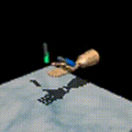
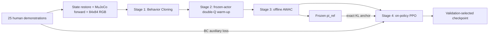

# Visual Offline-to-Online Reinforcement Learning for Adroit Pen Reorientation

A reproducible, simulation-only implementation of behavior cloning, double-Q critic warm-up, offline AWAC, and KL/BC-constrained online PPO for vision-based Adroit Pen reorientation.

## Public repository layout

The repository contains the reusable implementation (`src/`), command-line experiment entry points (`scripts/`), versioned configurations (`configs/`), CPU-oriented unit tests (`tests/`), compact result summaries (`results/`), the Chinese technical report source (`docs/` and `paper/`), and the frozen model bundle (`checkpoints/`). Raw Minari data, generated sequence banks, and training runs remain excluded. Run commands from the repository root so that relative artifact paths resolve consistently.

The three frozen checkpoints are versioned through Git LFS. After cloning, run `git lfs pull`; hashes and roles are listed in [`checkpoints/README.md`](checkpoints/README.md). The published E2 file has the same SHA-256 recorded by the confirmation report, and `configs/v6_1_confirmation.yaml` points to the complete vision/Oracle/E2 bundle.

V2 additionally evaluates a frozen-AWAC Residual SAC continuation and reports its failed promotion criterion without advancing to conditional hold-reset experiments.

V3 implements bounded, low-entropy Safe Residual SAC and reports the pre-specified 30k safety-pilot failure; later stages remain intentionally unrun.

V4 evaluates counterfactual simulation-guided visual policy refinement with true same-state branch outcomes and a hard-gated temporal student; branch labels are locally useful, but the student fails its branch-dev precision/false-positive gate.

## 中文技术材料

- [完整中文技术报告：从离线示范到时序视觉状态蒸馏](docs/adroit_pen_technical_report_zh.md)
- [编译版中文技术报告（PDF）](dist/adroit_pen_technical_report_zh.pdf)
- [机器人 / RL 实习面试复述与问答稿](docs/adroit_pen_interview_guide_zh.md)
- [可编辑 XeLaTeX / Overleaf 中文报告与本地编译说明](paper/README.md)

最终方法 **Temporal Visual-State Distillation** 使用 8-step RGB、proprioception 和历史动作估计视觉不可得的物理状态，再驱动 Frozen Oracle AWAC；privileged state 只用于训练监督，部署路径不读取 simulator truth。固定 E2 在独立 300-episode paired confirmation 上将 Benchmark / Strict 从 `52.3% / 27.0%` 提升至 `68.3% / 37.0%`，one-shot 200-episode frozen test 的 Benchmark 从 `54.5%` 提升至 `75.0%`。项目为纯仿真，无 sim-to-real 或真实硬件结果。



This project does **not** claim continuous 360-degree pen spinning, real-robot results, or sim-to-real transfer. It evaluates reorientation to the environment's sampled target pose.

## What is implemented



BC, AWAC, and PPO share one tanh-squashed diagonal Gaussian actor and one normalized `[-1, 1]^24` action interface. Log probabilities use the pre-tanh sample and tanh Jacobian. PPO keeps separate policies:

- `pi_old`: the frozen policy that generated the current rollout;
- `pi_ref`: the frozen validation-selected offline AWAC policy.

The PPO reference KL is the exact diagonal-Gaussian KL before tanh. Because tanh is bijective, this is also the exact KL between the squashed policies. The implementation checks old-policy KL before every minibatch update.

## Oracle and Vision inputs

| Line | Actor input | Critic/value input | Purpose |
|---|---|---|---|
| Oracle | Official 45D observation | Official 45D observation | Environment/action/algorithm sanity check only |
| Vision | 4 RGB frames at 84x84, `qpos[:24]`, `qvel[:24]`, previous action | Official 45D privileged state | Main deployable actor with asymmetric training |

The Vision actor never receives pen position, pen velocity, pen orientation, desired orientation, position error, orientation error, or official observation dimensions 24–44.

> **Actor: deployable visual observation. Critic/Value: simulation-only privileged state during training.**

## Environment and reconstructed offline data

The repository fixes one modern stack and never mixes it with legacy D4RL MuJoCo states:

- environment: `AdroitHandPen-v1`, dense reward, 200-step horizon;
- dataset: Minari `D4RL/pen/human-v2`;
- Python 3.11.15, Gymnasium 0.29.1, Gymnasium-Robotics 1.2.3, Minari 0.5.3, MuJoCo 2.3.7;
- PyTorch 2.8.0+cu128, EGL rendering;
- camera id `-1`, distance `1.0`, azimuth `-45`, elevation `-25`, lookat `[0, -0.2, 0.22]`.

Each source state restores `qpos`, `qvel`, and `desired_orien`, calls MuJoCo forward, and then obtains the low-dimensional observation, reward/success quantities, and RGB. Episode containers, termination, truncation/timeouts, and EOF are respected; no transition crosses an episode boundary.

| Data statistic | Actual |
|---|---:|
| Episodes | 25 |
| Source states | 5,000 |
| Container observations, including replayed final states | 5,025 |
| Valid intra-episode transitions | 4,975 |
| Nominal horizon | 200 |
| Action dimension | 24 |

The 20/5 episode development split is fixed by `split_seed=123`, and normalization uses only the 20 training episodes. The compact validation report is at [`results/data_validation.json`](results/data_validation.json). Key checks passed:

- 100 independently restored observations: max absolute error `5.55e-16`;
- exact `next_rgb[t] == rgb[t+1]` within each stored episode;
- 32 one-step replays: qpos error `1.17e-15`, qvel error `3.12e-13`, reward error `7.11e-15`;
- sequential full-trajectory reward error `1.14e-12` and zero cross-episode transitions.

The `0.0227` max sequential observation discrepancy is within the pinned `0.03` source tolerance and comes from derived MuJoCo kinematics in the source recording; explicit same-state restore is machine-precision accurate.

## Success definitions

- **Benchmark success:** the official goal condition is reached at any step of the episode.
- **Strict stable success:** every one of the final 20 steps satisfies the official goal condition, the pen is never dropped, and all states/actions remain finite.

Every evaluation also records drop rate, final orientation error (`1 - orientation_similarity`), time to first success, return, action magnitude, and action smoothness.

## Held-out results

The frozen Full method used five independent training seeds (`101–105`). Each validation-selected checkpoint was evaluated on 200 never-used test episodes (`50000–50199`), totaling 1,000 Full-method episodes. Development used `20000–20049`; frozen checkpoint selection used the disjoint `30000–30049` bank. Online rollout seeds are independently derived from each training seed.

| Method | Training seeds | Episodes | Benchmark success, mean ± std | Pooled benchmark (95% Wilson) | Strict success, mean ± std | Worst-seed benchmark / strict |
|---|---:|---:|---:|---:|---:|---:|
| Vision BC | 3 | 600 | 37.3% ± 11.2% | 37.3% (33.6–41.3%) | 14.7% ± 3.8% | 25.0% / 11.0% |
| Vision BC + AWAC | 3 | 600 | 51.0% ± 3.0% | 51.0% (47.0–55.0%) | 20.3% ± 5.3% | 49.0% / 15.5% |
| Vision BC + AWAC + PPO/KL/BC | 5 | 1,000 | 52.7% ± 2.6% | **52.7% (49.6–55.8%)** | 19.9% ± 5.9% | 49.5% / 12.5% |
| Full without KL/BC anchor | 3 | 600 | 51.3% ± 2.0% | 51.3% (47.3–55.3%) | 20.5% ± 5.0% | 49.5% / 15.5% |

Per-seed values are in [`results/final_test_by_seed.csv`](results/final_test_by_seed.csv), and the machine-readable aggregate is [`results/summary.csv`](results/summary.csv).

The Full method improves pooled benchmark success over BC, with most of the gain already delivered by offline AWAC. Anchored PPO does **not** reliably improve strict success, and the three-seed no-anchor comparison is statistically indistinguishable at this scale.

## V2: Frozen AWAC + Residual SAC

V2 tests whether a small online residual can improve the frozen Vision AWAC policy without changing the CNN or exposing simulator-only observations. The complete AWAC actor, CNN, normalization, and module mode are frozen. The deterministic action is

```text
a_exec = clip(a_awac_mean + residual_scale * tanh(u), -1, 1)
```

The residual actor is a two-layer 256-unit MLP over `[frozen_visual_latent, normalized_hand_proprio, a_awac_mean]`. Its mean head is zero-initialized and its initial log standard deviation is `-3`, so the step-0 deterministic policy is exactly AWAC (measured max action error `0.0`). Twin SAC critics use the same deployable frozen feature and the complete executed action; unlike the V1 asymmetric critics, **V2 Residual SAC never uses the 45D privileged state**. Each update mixes 50% fixed demonstration transitions with 50% online replay, uses reward `/ 50`, and bootstraps through time-limit truncations but not true terminations.

The fixed development run used seed 101, 100,000 actual training `env.step` transitions, and 50 fixed validation episodes (`30000–30049`). Evaluation transitions are excluded from the online counter.

| Residual scale | Trained steps | 10k benchmark / strict | 40k benchmark / strict | 100k benchmark / strict | Validation-selected steps |
|---:|---:|---:|---:|---:|---:|
| 0.2 (fixed first pass) | 100k | 62% / 30% | 32% / 26% | 28% / 26% | 0 |
| 0.1 (allowed rescue) | 100k | 64% / 30% | 64% / 34% | 52% / 20% | 0 |
| 0.4 (allowed pilot) | 30k | 30% / 10% | — | — | 0 |
| Frozen Vision AWAC E0 | 0 | 64% / 40% | 64% / 40% | 64% / 40% | 0 |

Checkpoint selection required strict success to remain within 2 percentage points of E0, then maximized benchmark success. No nonzero checkpoint met the strict floor of 38%. Scale 0.1 was the better rescue—its best nonzero point was 64% benchmark / 34% strict at 40k—but it still did not improve benchmark and lost 6 points of strict success.

Final-window training diagnostics were:

| Residual scale | Residual L2 | Scaled residual L2 | Combined-action saturation | Q mean / target | Critic loss | Temperature |
|---:|---:|---:|---:|---:|---:|---:|
| 0.2 at 100k | 2.855 | 0.571 | 27.8% | 610.19 / 610.20 | 8.23 | 0.0743 |
| 0.1 at 100k | 3.183 | 0.318 | 28.0% | 83.93 / 83.93 | 1.45 | 0.00585 |
| 0.4 at 30k | 2.886 | 1.155 | 43.0% | 169.90 / 169.91 | 1.55 | 0.0292 |

At each run's terminal checkpoint, goal-entry / goal-exit-after-entry / **consecutive-20-step-window** rates were 28% / 14% / 26% for scale 0.2 at 100k, 52% / 65% / 34% for scale 0.1 at 100k, and 20% / 20% / 16% for scale 0.4 at 30k. These window rates are diagnostics, not strict success: in particular, scale 0.1 at 100k had **20% strict success**, while 34% merely achieved a 20-step success window somewhere in the episode. Saturation remained far above the predefined 5% diagnostic threshold. Scale 0.2 also showed Q-scale drift, while scale 0.1 stabilized Q but still degraded closed-loop hold behavior.

Therefore Residual SAC **did not pass the development promotion criterion**. The pre-specified three-seed paired experiment, H0/H1 hold-reset curriculum, and five-seed frozen test were not run. This is intentional: hold curriculum was conditional on a non-degrading Residual SAC base, and reporting downstream comparisons after that prerequisite failed would not be a valid matched-budget result. The selected V2 checkpoint is the 0-step AWAC-equivalent checkpoint at:

```text
runs/v2/residual_sac_rescue/scale_0p1_seed_101/best_residual_sac_validation.pt
```

Machine-readable curves and the explicit downstream status are under [`results/v2/`](results/v2/); the combined plot is [`results/v2/residual_sac_validation.png`](results/v2/residual_sac_validation.png). Representative selected-checkpoint rollouts are:

- [strict success, seed 30001](results/videos/v2/episode_000_seed_30001_success.mp4)
- [benchmark failure, seed 30000](results/videos/v2/episode_000_seed_30000_failure.mp4)

## V3: Safe Residual SAC

V3 restarts from the seed-101 0-step Frozen Vision AWAC checkpoint; none of the V2 residual checkpoints are reused. The AWAC actor, lightweight CNN, normalization, and module mode remain frozen. The residual uses the existing frozen visual latent, normalized hand proprioception, and deterministic AWAC action, with no simulator-only policy input. Instead of hard clipping an additive residual, it uses directional action headroom:

```text
positive_room = 1 - a_base
negative_room = 1 + a_base
directional_delta = relu(z) * positive_room - relu(-z) * negative_room
a_exec = a_base + rho * directional_delta
```

Here `rho=0.05`, `z=tanh(u)`, residual `log_std=-3` is fixed, entropy temperature is fixed at `1e-4`, and the mean head is zero-initialized. The actor objective normalizes the critic's predicted gain and anchors the **executed correction** to zero with a `0.03` correction budget. Critic batches remain 50% offline / 50% online, while actor batches contain online observations only. The first 10k transitions force `rho_effective=0` and disable actor updates; `rho_effective` then ramps to `0.05` over 5k transitions.

The fixed 100-episode development bank is `30000–30099`, so its E0 estimate (`62% / 34%`) is paired internally and should not be substituted with V2's older 50-episode estimate (`64% / 40%`). Evaluation transitions are not counted as online training steps.

| Online steps | Benchmark | Strict | Goal entry | Goal exit after entry | Consecutive 20-step window |
|---:|---:|---:|---:|---:|---:|
| 0 (Frozen AWAC E0) | 62% | 34% | 62% | 59.7% | 53% |
| 10k (critic warm-up) | 62% | 34% | 62% | 59.7% | 53% |
| 20k | 55% | 26% | 55% | 67.3% | 43% |
| 30k final | 59% | 23% | 59% | 67.8% | 45% |

At 30k, the action-side safety mechanism behaved as intended:

| Diagnostic at 30k | Value |
|---|---:|
| Executed correction RMS / maximum per-dimension RMS | 0.00510 / 0.01023 |
| `abs(z) > 0.95` | 0.000% |
| AWAC base / executed boundary rate | 55.19% / 55.00% |
| Residual-added boundary rate | 0.071% |
| Numerical guard-clamp count | 0 |

The high absolute boundary rate comes from the frozen AWAC base; the residual added almost no new boundary actions. Critic predictions remained finite and under the conservative discounted-reward bound, but calibration worsened: mean `Q(a_base)` / finite-horizon scaled Monte Carlo return / bias changed from `31.11 / 26.08 / 5.04` at 10k to `62.16 / 22.08 / 40.08` at 30k. The predicted mean Q gain at 30k was only `0.040` scaled-return units, while closed-loop strict success fell by 11 percentage points.

The pre-specified 30k gate therefore **failed** on benchmark, strict, and goal-entry performance. Because the failure was not isolated to correction RMS or `abs(z)` saturation, the one permitted `lambda_anchor=0.10` rescue was not eligible. Training did not continue to 100k; the 200-episode confirmation, three-seed handoff, H0/H1 hold curriculum, and frozen test were not run. The only legal selected checkpoint remains the exact 0-step AWAC-equivalent checkpoint:

```text
runs/v3/safe_residual_sac/anchor_0p05_seed_101/best_safe_residual_validation.pt
```

The failed 30k candidate is retained separately as `last_safe_residual_sac.pt`; it is not presented as the selected policy. Machine-readable paired outcomes and diagnostics are in [`results/v3/`](results/v3/), and the combined curve is [`results/v3/safe_residual_validation.png`](results/v3/safe_residual_validation.png).

## V4: Counterfactual simulation-guided visual policy refinement

V4 replaces learned-Q residual labels with deterministic same-state MuJoCo branches. Simulator state is used only to restore training roots and generate supervision. A deployable student would still receive only frozen visual features, normalized hand proprioception, and its own base/executed action history. This stage is supervised policy refinement, **not online RL**.

On the shared 100-episode bank (`30000–30099`), Frozen Vision AWAC scores 62% benchmark / 34% strict, while the strongest existing state-based Oracle AWAC scores 75% / 42%. New Frozen Vision AWAC rollouts over training seeds starting at `5000000` supplied 240 roots:

| Root type | Roots | Positive local branches | Positive rate |
|---|---:|---:|---:|
| Far/pre-goal failure | 60 | 8 | 13.3% |
| Near-goal | 60 | 6 | 10.0% |
| Goal-entry pending exit | 60 | 29 | 48.3% |
| Stable hold | 60 | 9 | 15.0% |
| **Overall** | **240** | **52** | **21.7%** |

Roots came from 244 source episodes with at most two roots per trajectory and at least 30 original-horizon steps remaining. The source-episode-isolated split contains 188 train roots from 126 trajectories and 52 dev roots from 31 trajectories. Every root stores the complete simulator/task state, elapsed step, RNG states, RGB frame stack, real four-step frozen-latent/proprio history, and base/executed action history.

The zero branch was checked for five continuation steps at every root (1,200 checked steps). Vision actions and RGB were exactly equal, reward max error was `2.84e-14`, and next-step privileged observation error was zero. The restore instant has a maximum `0.0215` simulator-only 45D derived-kinematics discrepancy after MuJoCo forward; policy-visible observations are exact and the discrepancy disappears after one step.

Each root evaluates 14 local candidates including zero plus 5/20-step Oracle takeovers used only for route diagnosis. All local labels remain in the `rho=0.05` headroom family. The 30-step screening plus zero/Top-3 episode completion consumed 195,403 branch transitions. Positive winners came from PCA directions (26), Oracle–Vision directions (24), and the retained Safe Residual mean (2); no takeover action is used as a local target. Across positive roots, event improvements included 9 strict outcomes, 7 benchmark outcomes, 2 avoided exits, 45 longer goal streaks, and 51 increases in goal steps. The mean winning correction RMS was `0.0128`.

The Phase-A thresholds passed: overall positive-root rate was at least 15%, and goal-entry/exit positive rate was 48.3%. A frozen-CNN, one-layer GRU-128 student was therefore trained with balanced gate BCE, positive Huber residual regression, and a zero target on negative roots.

The student did **not** pass branch-dev:

- at 50% coverage, precision was 30.8% and false-positive rate was 43.9%;
- thresholds with zero false positives also had zero coverage;
- positive residual RMSE was `0.4210` train / `0.4237` dev, versus `0.4566` / `0.4335` for an always-zero residual predictor.

No threshold satisfies precision at least 80%, false-positive rate at most 5%, and coverage at least 5%. Residual regression improves the zero predictor by only 7.8% train and 2.3% dev, so the one permitted last-CNN-block rescue is not eligible. Round 0 closed-loop evaluation, both DAgger rounds, 200-episode confirmation, multi-seed training, and frozen test were not run. The selected deployable checkpoint remains Frozen Vision AWAC:

```text
runs/frozen/vision/full_seed_101/best_offline_awac_validation.pt
```

The failed student fit is retained locally as `runs/v4/counterfactual_pilot/best_gated_student.pt`, but has no valid gate threshold and the evaluator refuses to treat it as a closed-loop candidate. Compact evidence is under [`results/v4/`](results/v4/); the branch and gate plot is [`results/v4/counterfactual_pilot_and_gate.png`](results/v4/counterfactual_pilot_and_gate.png).

## V5: Candidate-conditioned conservative refinement

V5 replaces the V4 root gate and single-winner regression with candidate-level gain/harm ranking. It is **counterfactual simulation-guided visual policy refinement**, not online RL. Deployment inputs remain frozen AWAC visual latent, hand proprioception, and base/executed action history; simulator state is used only by diagnostic ranking and branch-label generation.

The initial bank contains zero, eight fixed PCA/local candidates, and eight fixed codebook chunks clustered only from branch-train trajectories. Completing all 17 candidates to a common original episode horizon produced 4,080 records and 464,457 transitions. The hindsight upper bound moved benchmark/strict from 67.5%/34.6% to 71.3%/43.3%, but both privileged and frozen-visual rankers failed the conservative branch-dev selector.

One predefined expansion produced 1,200 training-bank roots (600 pending-exit, 300 stable-hold, 180 near-goal, 120 far), 20,400 records, and 2,413,490 branch transitions. It contained 178 strong-gain roots; the fixed-bank hindsight upper bound moved benchmark/strict from 84.8%/35.3% to 86.3%/46.7% and avoided 22 exits.

| Selector on branch-dev | Coverage | Precision | Harm | Strict zero to selected | Exit zero to selected |
|---|---:|---:|---:|---:|---:|
| Expanded fixed-bank privileged | 15.3% | 21.1% | 10.5% | 37.8% to 38.6% | 59.0% to 58.2% |
| Plus visual 5-step proposal | 18.1% | 28.9% | 11.1% | 37.8% to 40.2% | 59.0% to 56.2% |

Both miss precision at least 80% and harm at most 5%. Oracle five-step takeover branches yielded 205 strong gains and 223 harms. A branch-filtered visual proposer yielded 172 gains and 190 harms, and adding it still did not make even the privileged selector safe. The augmented visual ranker, closed-loop validation bank, DAgger, confirmation, multi-seed reproduction, and frozen test were therefore not run. The deployable checkpoint remains Frozen Vision AWAC. Compact evidence is under [`results/v5/`](results/v5/); generated branches and checkpoints remain ignored under `runs/v5/`.

### PPO online-step behavior

| Training seed | Validation-selected online steps | 50-episode benchmark / strict |
|---:|---:|---:|
| 101 | 0 | 64% / 40% |
| 102 | 4,096 | 62% / 28% |
| 103 | 8,192 | 68% / 18% |
| 104 | 10,240 | 78% / 36% |
| 105 | 0 | 72% / 34% |

Seeds 101 and 105 selected the exact offline handoff because all online points degraded validation strict success. Reference KL stayed controlled, so this is performance drift rather than non-finite or numerically explosive training. Curves are under [`results/learning_curves/`](results/learning_curves/).

### Oracle sanity line

The single development seed achieved 65% benchmark / 55% strict after Oracle BC (20 validation episodes) and 75% / 50% after AWAC. With the final exact-KL PPO implementation, the 50-episode offline handoff was 72% / 40%; all online points were worse, so validation selection retained the 0-step actor. Oracle numbers are implementation sanity checks, not visual-policy results.

## Visual causal interventions

All interventions use the same five Full checkpoints and the same 1,000 physical test episodes. Hand proprioception and previous action are unchanged.

| RGB condition | Pooled benchmark | Pooled strict | Interpretation |
|---|---:|---:|---|
| Normal | 52.7% | 19.9% | Reference |
| All black | 22.7% | 9.5% | Removing visual content causes a large drop |
| Cross-episode RGB | 27.0% | 5.8% | Mismatched visual state causes a large drop |
| Frame order shuffled | 53.5% | 19.4% | No reliable temporal-order dependence |
| Green target occluded | 40.8% | 12.5% | Target pixels contribute to control |

These results establish causal dependence on RGB content and target appearance. They do not establish meaningful use of four-frame temporal order. Full intervention statistics and Wilson intervals are in [`results/visual_interventions.csv`](results/visual_interventions.csv).

## Reproduction

The Minari data are intentionally not committed.

```bash
conda env create -f environment.yml
conda activate visual-adroit-pen

python -m scripts.build_visual_dataset --config configs/data.yaml
python -m scripts.train_oracle --config configs/oracle_full.yaml --seed 0
python -m scripts.train_vision --config configs/vision_frozen.yaml --seed 101
python -m scripts.evaluate \
  --run-dir runs/frozen/vision/full_seed_101 --stage ppo --split test
```

Run V2's fixed 100k development experiment and evaluate its validation-selected checkpoint with:

```bash
python -m scripts.train_residual_sac --config configs/residual_sac.yaml --seed 101
python -m scripts.evaluate_residual \
  --run-dir runs/v2/residual_sac/scale_0p2_seed_101 --split validation
```

Resume preserves the residual actor, critics and targets, all optimizers, entropy temperature, disk-backed online replay, exact transition count, Python/NumPy/PyTorch/CUDA RNG, MuJoCo state, elapsed time, previous action, and RGB frame stack:

```bash
python -m scripts.train_residual_sac \
  --config configs/residual_sac.yaml --seed 101 --resume
```

Reproduce the only two permitted rescue pilots, continue the selected scale, and rebuild V2 result files with:

```bash
python -m scripts.train_residual_sac --config configs/residual_sac.yaml --seed 101 --residual-scale 0.1 --online-steps 30000 --run-root runs/v2/residual_sac_rescue
python -m scripts.train_residual_sac --config configs/residual_sac.yaml --seed 101 --residual-scale 0.4 --online-steps 30000 --run-root runs/v2/residual_sac_rescue
python -m scripts.train_residual_sac --config configs/residual_sac.yaml --seed 101 --residual-scale 0.1 --online-steps 100000 --run-root runs/v2/residual_sac_rescue --resume
python -m scripts.summarize_residual_sac
```

Run the V3 seed-101 safety pilot from the 0-step Frozen AWAC checkpoint and rebuild its compact result bundle with:

```bash
python -m scripts.train_safe_residual_sac \
  --config configs/safe_residual_sac.yaml --seed 101
python -m scripts.summarize_safe_residual_sac
```

Resume is exact, including actor/critics/targets, optimizers, Q-scale EMA, disk-backed online replay, transition count, RNG state, MuJoCo state, elapsed step, previous action, and RGB frame stack. The following continuation is valid only after the recorded 30k decision has `pass=true`; it was therefore **not run** for the reported experiment:

```bash
python -m scripts.train_safe_residual_sac \
  --config configs/safe_residual_sac.yaml --seed 101 \
  --online-steps 100000 --resume
```

Re-evaluate either the selected 0-step checkpoint or the retained 30k failed candidate without counting evaluation steps as training:

```bash
python -m scripts.evaluate_safe_residual \
  --run-dir runs/v3/safe_residual_sac/anchor_0p05_seed_101 \
  --split validation
python -m scripts.evaluate_safe_residual \
  --run-dir runs/v3/safe_residual_sac/anchor_0p05_seed_101 \
  --checkpoint runs/v3/safe_residual_sac/anchor_0p05_seed_101/last_safe_residual_sac.pt \
  --split validation --with-critic
```

Build the V4 roots and branch labels, train the branch-supervised student, and regenerate compact results with:

```bash
python -m scripts.build_counterfactual_dataset \
  --config configs/counterfactual_residual.yaml
python -m scripts.train_gated_residual \
  --config configs/counterfactual_residual.yaml
python -m scripts.summarize_counterfactual
```

Root collection and branch search checkpoint independently. Resume an interrupted Phase-A run with:

```bash
python -m scripts.build_counterfactual_dataset \
  --config configs/counterfactual_residual.yaml --resume
```

`scripts.evaluate_gated_residual` intentionally refuses the reported student checkpoint because branch-dev selected no valid gate threshold. It becomes usable only for a future checkpoint whose saved `gate_threshold` is non-null.

Build and train the V5 fixed candidate bank, including the single predefined expansion, with:

```bash
python -m scripts.build_candidate_dataset --config configs/candidate_ranker.yaml
python -m scripts.train_candidate_ranker --config configs/candidate_ranker.yaml
python -m scripts.expand_candidate_dataset --config configs/candidate_ranker.yaml --resume
python -m scripts.train_expanded_privileged_ranker
```

Reproduce the branch-filtered five-step Oracle chunk fallback with:

```bash
python -m scripts.build_oracle_chunk_dataset
python -m scripts.train_oracle_chunk_proposer
python -m scripts.branch_oracle_chunk_proposals
python -m scripts.train_oracle_chunk_augmented_ranker
```

All builders checkpoint branch progress under `runs/v5/`; generated roots, full branch records, and checkpoints are intentionally ignored by Git.

Long stages checkpoint optimizer, progress, and NumPy/PyTorch/CUDA RNG state. Resume with:

```bash
python -m scripts.train_vision \
  --config configs/vision_frozen.yaml --seed 101 --resume
```

Run the full ordered experiment (including all frozen seeds, ablations, interventions, and summaries) with:

```bash
bash scripts/run_reproduction.sh
```

Run tests with `pytest`. Tests additionally cover exact counterfactual zero-branch continuation, closed-gate Frozen AWAC equivalence, naturally bounded headroom actions, and source-episode-isolated branch train/dev splits.

## Artifacts

- data validation sample: [`results/data_samples/offline_states.png`](results/data_samples/offline_states.png)
- success rollout: [`results/videos/episode_000_seed_50005_success.mp4`](results/videos/episode_000_seed_50005_success.mp4)
- failure rollout: [`results/videos/episode_000_seed_50000_failure.mp4`](results/videos/episode_000_seed_50000_failure.mp4)
- frozen checkpoint pattern: `runs/frozen/vision/full_seed_<101..105>/best_online_ppo_validation.pt`
- V3 paired summary: [`results/v3/safe_residual_paired_summary.csv`](results/v3/safe_residual_paired_summary.csv)
- V3 per-episode paired outcomes: [`results/v3/safe_residual_paired_episodes.csv`](results/v3/safe_residual_paired_episodes.csv)
- V3 experiment status: [`results/v3/experiment_status.json`](results/v3/experiment_status.json)
- V4 same-bank baselines: [`results/v4/same_bank_baselines.csv`](results/v4/same_bank_baselines.csv)
- V4 positive roots: [`results/v4/branch_positive_roots.csv`](results/v4/branch_positive_roots.csv)
- V4 gate thresholds: [`results/v4/gate_thresholds.csv`](results/v4/gate_thresholds.csv)
- V4 experiment status: [`results/v4/experiment_status.json`](results/v4/experiment_status.json)
- V4 failed branch-dev student fit: [`results/v4/gated_student_branch_dev_failed.pt`](results/v4/gated_student_branch_dev_failed.pt) (not deployable)
- V5 compact summary: [`results/v5/summary.csv`](results/v5/summary.csv)
- V5 expanded fixed-bank upper bound: [`results/v5/expanded_candidate_dataset_summary.json`](results/v5/expanded_candidate_dataset_summary.json)
- V5 final Oracle-chunk selector: [`results/v5/oracle_chunk_augmented_privileged_summary.json`](results/v5/oracle_chunk_augmented_privileged_summary.json) (diagnostic only)

The three frozen files documented in [`checkpoints/README.md`](checkpoints/README.md) are committed through Git LFS. All other training checkpoints and full per-episode run JSON remain generated, ignored artifacts.

## Known limitations

- V5 finds substantial hindsight candidate gains, but even a simulator-state privileged selector reaches only 28.9% intervention precision with 11.1% harm after adding a visual Oracle-chunk proposal; no V5 policy is deployable and no closed-loop validation/test score is claimed.
- The one permitted V5 expansion produced 178 fixed-bank positive roots, short of the target 200; another data expansion was not run.
- V4 proves that small representable corrections can improve true same-state branch outcomes, especially near goal exit, but the frozen visual representation/GRU cannot predict those interventions with adequate precision or fit their directions substantially better than zero.
- No V4 student closed-loop score is reported: branch-dev failed before Round 0, so DAgger, confirmation, multi-seed, and frozen-test claims would be invalid.
- V3 establishes action-side safety but not performance safety: the 30k candidate had zero numerical clamps and small corrections, yet strict success fell from 34% to 23% on the paired 100-episode bank.
- The Safe Residual critic remained within a conservative discounted-return bound but its mean Q-minus-Monte-Carlo bias grew from 5.04 at 10k to 40.08 at 30k. The failed 30k gate prevented any 100k, multi-seed, curriculum, or frozen-test claim.
- V2 Residual SAC failed its development promotion criterion: no nonzero checkpoint preserved strict success within 2 points of Frozen AWAC, so paired multi-seed, hold-curriculum, and final-test claims are intentionally absent.
- Residual actions caused persistent combined-action saturation; reducing scale from 0.2 to 0.1 stabilized Q but did not prevent strict-success degradation.
- The strong-result target was not met: pooled benchmark success is 52.7%, and its Wilson lower bound is 49.6%, not 80%.
- Strict stable success remains low (19.9% pooled), with substantial training-seed variance.
- PPO provides only small benchmark gains over AWAC and sometimes reduces strict stability; KL/BC anchors did not outperform the no-anchor control across three seeds.
- Shuffling frame order does not hurt performance, so the current lightweight CNN does not demonstrate useful short-horizon temporal reasoning.
- The dataset contains only 25 human episodes, observations use one fixed camera, and no separately trained proprio-only baseline is included.
- Results are simulation-only; there is no real-world data collection, real-robot experiment, or sim-to-real claim.

## Resume bullet

> Implemented and benchmarked a reproducible visual offline-to-online RL pipeline for Adroit Pen reorientation using 25 human demonstrations, combining behavior cloning, double-Q critic warm-up, offline AWAC, and KL/BC-constrained PPO; across 5 training seeds and 1,000 held-out simulation episodes, achieved 52.7% pooled benchmark success (95% Wilson CI: 49.6–55.8%) versus 37.3% for BC, while black-frame and cross-episode RGB interventions reduced success to 22.7% and 27.0%.

## License

Apache-2.0. See [`LICENSE`](LICENSE).
