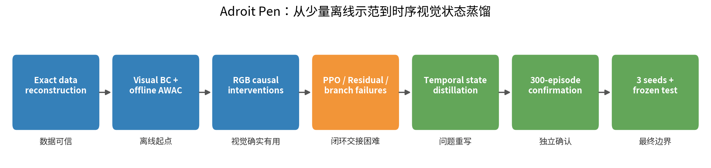
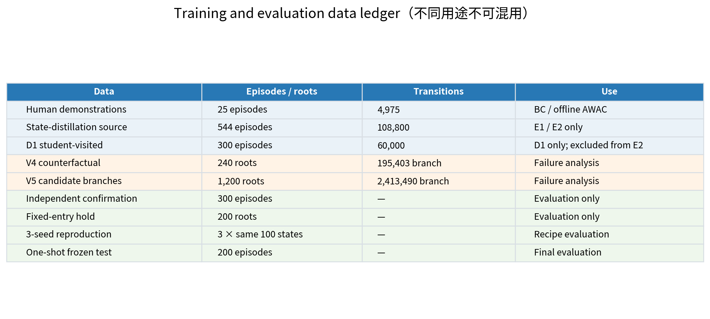
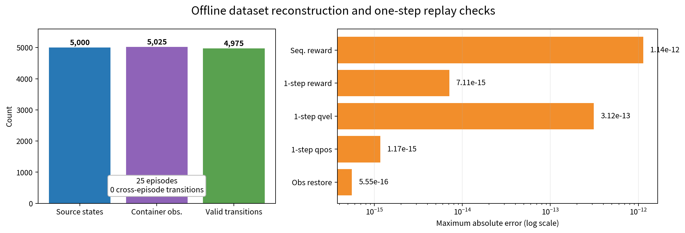
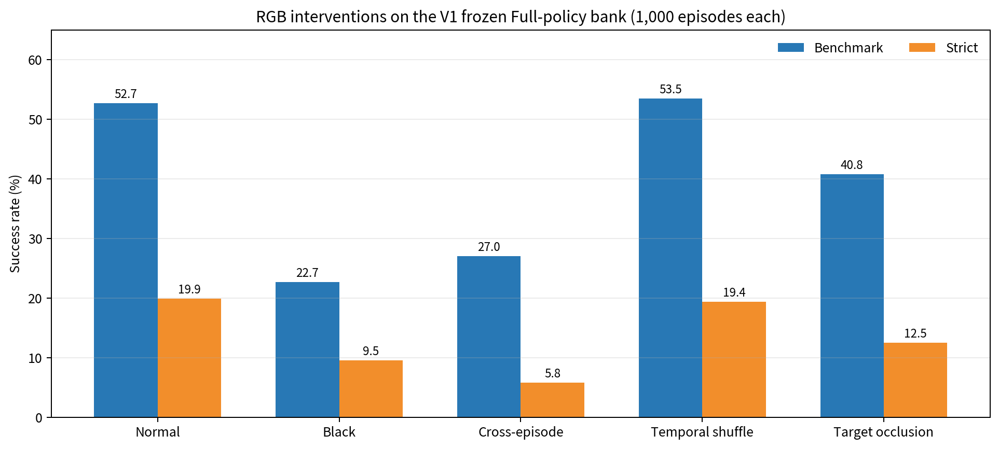
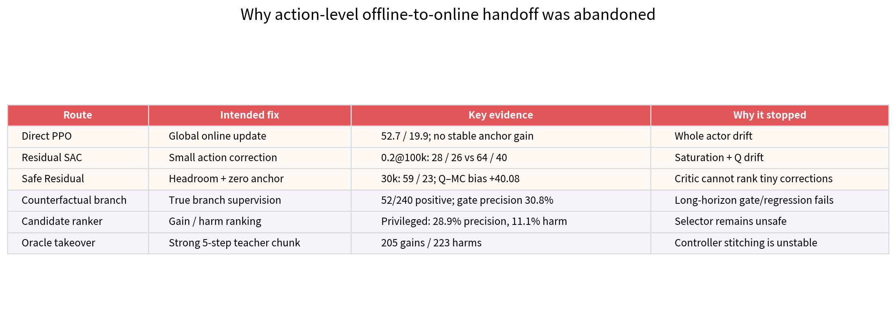
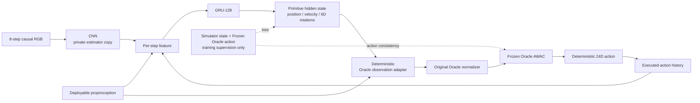
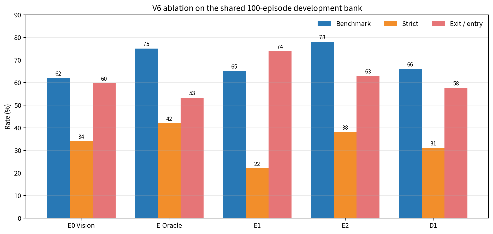
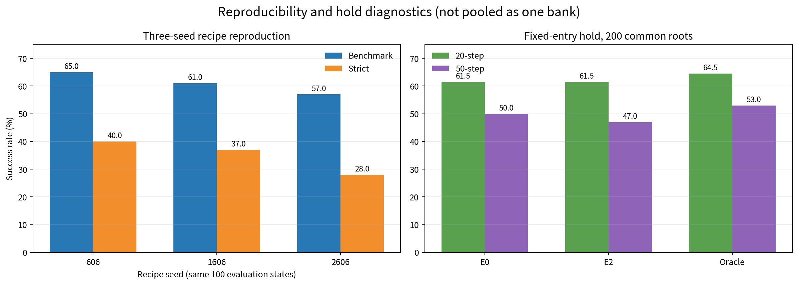
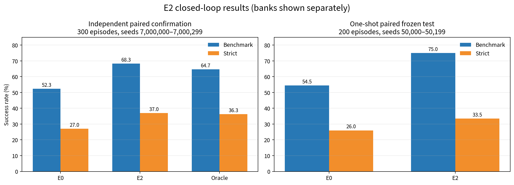

# 从离线示范到时序视觉状态蒸馏：Adroit Pen 视觉灵巧操作的复现、失败分析与闭环验证

> 本文记录一个纯仿真的 Adroit Pen Reorientation 项目。所有结论均来自仓库中已经冻结的 V1–V6.1 结果；本文没有重新训练模型，也没有重新运行 confirmation 或 frozen test。

## 摘要

本项目研究如何让视觉策略在 Adroit 灵巧手环境中完成笔的目标姿态重定向。我们首先从 25 条 human demonstrations 中恢复 5,000 个源状态，并在严格排除跨 episode 边界后得到 4,975 条合法离线 transition，以 Behavior Cloning（BC）、critic warm-up 和 offline AWAC 建立视觉控制基线。随后，RGB 黑屏、跨 episode 打乱和目标遮挡实验表明图像内容确实影响策略，但时间顺序打乱几乎不降性能，暴露出基础视觉表征对动态信息利用不足。Direct PPO、Residual SAC、安全残差、反事实分支监督与候选排序均未能稳定改善接触敏感闭环：问题并非只有动作改动过大，更在于用稀疏长时结果可靠判断微小修正的收益十分困难。最终，我们把问题从“此刻应该怎样改动作”改写为“此刻物体的隐含物理状态是什么”，提出 Temporal Visual-State Distillation：利用 544 条仿真轨迹、108,800 个时序样本，以 privileged state 和 Frozen Oracle action 作为训练监督，学习仅依赖 8-step RGB、proprioception 与历史动作的因果状态估计器，再经冻结 Oracle AWAC 输出动作。固定 E2 在独立 300-episode paired confirmation 上将 Benchmark 从 52.3% 提升至 68.3%，Strict 从 27.0% 提升至 37.0%；在一次性 200-episode frozen test 上，Benchmark 从 54.5% 提升至 75.0%，Strict 从 26.0% 提升至 33.5%。项目完全处于仿真环境，没有 sim-to-real 或真实硬件结果；长期 hold、训练 seed 方差和 frozen-test Strict 的统计不确定性仍是明确限制。



**图 1｜总体研究路线。** 图中各阶段来自不同开发或评测 bank，不是同一条学习曲线。它表达的是问题求解顺序：先验证数据和视觉因果性，再利用失败实验定位 offline-to-online 交接困难，最后用全新独立 bank 验证冻结的 E2。

## 1. 引言与研究问题

Adroit Pen Reorientation 要求一只 24 自由度灵巧手在有限 horizon 内调整笔的三维姿态，使其与环境给出的目标姿态一致。它不是连续 360° 转笔，也不是只靠末端位置对齐即可完成的抓取任务。手指与笔之间存在多点接触、摩擦、碰撞和约束切换；一个瞬时看似无害的关节动作可能改变接触模式，并在几十步后放大为掉落或退出目标区域。因此，策略既要获得目标，又要在 episode 尾段稳定保持。

视觉版本进一步引入三类困难。第一，单相机 RGB 只提供投影，笔的自转、遮挡部分和角速度不能在单帧中被直接观测，问题具有部分可观测性（partial observability）。第二，标准 human 数据只有 25 条轨迹，足以提供动作先验，却不足以覆盖闭环中的各种偏离状态。第三，offline-to-online 切换非常脆弱：已经能工作的离线 actor 周围并不一定存在由 bootstrapped critic 正确排序的局部改进方向。视觉误差、Q 误差和接触动力学可以共同把很小的策略更新放大为闭环退化。

本项目围绕四个具体问题展开：

1. `D4RL/pen/human-v2` 能否在固定环境版本下恢复为不跨 episode、动力学一致的合法 transition？
2. 视觉 actor 是否真的使用 RGB，还是仅依赖手部 proprioception 和历史动作形成捷径？
3. 为什么 PPO、Residual SAC 和局部反事实动作修正会破坏已有闭环，而不是稳定提高它？
4. 如果稀疏长时收益难以预测，能否改用稠密的 privileged state 与 Oracle action 监督，直接学习时序视觉状态重建？

围绕这些问题，本项目完成了三项主要工作。其一，固定 Gymnasium-Robotics、Minari 和 MuJoCo 版本，验证状态恢复、一步 replay、episode 分割与 RGB 重建。其二，用视觉干预和一系列受控负结果定位 offline-to-online 交接的真实瓶颈：动作级 gain/harm 判断接近一个困难的长时 action-value 问题。其三，实现 Temporal Visual-State Distillation，并用独立 300-episode paired confirmation、3 个训练 recipe seed 和一次性 frozen test 划清可复现收益与统计边界。

这不是“只用 25 条示范得到 75% 成功率”的故事。25 条示范训练了离线 AWAC 基础控制器；最终 E2 还使用了 544 条仿真轨迹和 108,800 个稠密时序样本，以仿真真值和 Frozen Oracle action 作为训练监督。privileged 信息不进入部署输入，最终提升主要来自监督式时序状态蒸馏，而不是 online RL。

**本章结论。** 视觉灵巧操作的核心矛盾不是单一算法选择，而是少量离线示范、部分可观测性与接触敏感闭环之间的共同作用。后续实验始终把“数据是否可信”“视觉是否有因果作用”和“改进是否在未见 bank 上成立”分开回答。

## 2. 任务、环境、指标与数据

### 2.1 环境与动作接口

实验固定使用 `AdroitHandPen-v1` 的 dense-reward 配置，数据集为 Minari 提供的 `D4RL/pen/human-v2`。episode horizon 为 200，动作维度为 24；actor 输出统一映射到环境动作范围。主要环境版本是 Python 3.11.15、Gymnasium 0.29.1、Gymnasium-Robotics 1.2.3、Minari 0.5.3、MuJoCo 2.3.7、NumPy 1.26.4 和 PyTorch 2.8.0+cu128。渲染使用 EGL、84×84 RGB、固定 camera id `-1`，相机参数为 distance 1.0、azimuth −45°、elevation −25°、lookat `[0, -0.2, 0.22]`。

Oracle actor 使用官方 45 维完整 observation，包括手部状态、物体和目标的仿真真值。初始视觉 actor 的部署输入是 4-frame RGB history、`qpos[:24]`、`qvel[:24]` 和 previous action；最终 E2 使用 8-step 因果 RGB、同样可部署的 proprioception 与 executed-action history。训练阶段可以用 simulator state 做监督，但 E2 推理路径不会读取笔的位置、速度、姿态、目标真值或其他 privileged state。

### 2.2 成功率和保持指标

**Benchmark success** 与环境 `info["success"]` 兼容：episode 任意时刻进入官方目标条件即计为成功。它回答“策略有没有到过目标”，但不保证之后仍然稳定。

**Strict success** 要求 episode 最后连续 20 steps 都满足官方目标条件，同时笔未掉落，state/action 中没有 non-finite 数值。它更接近“完成后稳定保持”的项目目标，因而是与 Benchmark 并列报告的核心指标。

为理解成功结构，报告还使用三个诊断量：

- **Goal entry**：episode 是否至少一次进入目标区域；在当前实现中与 Benchmark 的事件口径一致。
- **Exit after entry**：已经 entry 的 episode 中，之后再次退出目标区域的比例。
- **20-step hold**：episode 内是否出现至少连续 20 步处于目标区域的窗口。

需要特别注意，Exit/Entry 是条件比例，分母取决于策略自己的 entry 数。若一个策略很少进入目标，exit ratio 可能看上去较低，却不代表保持能力更强。D1 就出现了这类 acquisition–hold 反向移动。因此它只用于诊断，不能替代 Benchmark、Strict 或共同 root 的 fixed-entry survival。

**Fixed-entry hold** 从同一批 E0 first-entry simulator roots 恢复多个策略，比较从完全相同状态起始后的 20-step 和 50-step survival。它控制了“谁先进入、进入了多少次”的差异，更接近对保持能力的共同状态诊断；但它仍然是仿真恢复实验，不等价于整条闭环 episode 指标。

### 2.3 训练与评测数据账本

| 数据 | 规模 | 用途 | 是否进入最终 E2 训练 |
| --- | ---: | --- | :---: |
| Human demonstrations | 25 episodes、4,975 transitions | BC、critic warm-up、offline AWAC | 基础控制器 |
| State-distillation source | 544 simulation episodes、108,800 transitions | E1/E2 时序状态估计 | 是 |
| D1 student-visited data | 300 episodes、60,000 transitions | 仅训练 D1 | 否 |
| V4/V5 branch data | 240 roots / 1,200 roots 的反事实候选实验 | 失败机制分析 | 否 |
| Confirmation | 300 episodes | 独立 paired 评测 | 否 |
| Fixed-entry hold | 200 common roots | 共同状态 hold 诊断 | 否 |
| 3-seed evaluation | 3 个 recipe seed，各评同一组 100 states | 配方复现 | 否 |
| Frozen test | 200 episodes | 一次性最终测试 | 否 |



**图 2｜训练与评测数据账本。** Human demo、state-distillation source、D1 数据、反事实 branch 数据和评测 bank 用途互不替换。3-seed 的三个模型使用相同 100 个 evaluation states，因此不能把它们当作 300 个独立初始状态计算普通 pooled binomial CI；confirmation 与 frozen test 则是独立于训练的数据。

544 条 state-distillation 轨迹由两部分构成：已有 V4 training rollout 的 244 episodes，加上新采集的 300 条 Frozen Oracle simulation episodes，共 108,800 个长度为 200 的稠密时序样本。D1 额外访问 300 episodes、60,000 transitions，但仅用于 D1 实验，不能倒算进已冻结的 E2 训练集。V4/V5 的 branch rollout 用于判断局部动作修正是否可行，也没有进入 E2。

**本章结论。** 报告同时衡量“到达”和“保持”，并把条件性 exit 指标与共同 root 的 hold 诊断分开。最终 E2 是部署时只读取 RGB、proprioception 和动作历史的视觉策略，但其训练数据明显超过 25 条 human demo，任何结果解读都必须保留这一区别。

## 3. 数据重建与视觉数据集

### 3.1 Episode 分割与合法 transition

Minari 数据以 episode container 组织。每条人类示范名义 horizon 为 200，25 个 episode 共包含 5,000 个 source states；把每个 episode replay 得到的 final observation 计入 container 后共有 5,025 个 observations。合法 transition 只能在单个 episode 内连接相邻状态，因此数量是：

\[
\sum_{i=1}^{25}(T_i-1)=5000-25=4975.
\]

这里的减 25 来自每个 episode 最后状态没有同 episode 的下一状态，而不是把 24 个结束标记误读为只有 24 条 episode。实现同时尊重 episode container、`terminated`、`truncated/timeouts` 和文件 EOF；最终检查到的跨 episode transition 数为 0。

每个状态至少恢复 `qpos`、`qvel` 和 `desired_orien`，再执行 MuJoCo forward，重新获得 low-dimensional observation、reward、success 和 RGB。恢复过程固定 XML、reward 类型、horizon、动作映射、renderer 和相机，避免把 legacy D4RL state 静默送入不兼容的新环境。

### 3.2 机器精度恢复与一步 replay



**图 3｜数据重建与一步 replay。** 检查覆盖 25 episodes、100 个随机恢复状态和 32 个一步动力学样本。左图说明 5,000 source states、5,025 container observations 与 4,975 valid transitions 的关系；右图为最大绝对误差的对数坐标。该图是数据正确性验证，不是策略性能评测。

随机 100 个离线状态的 restored observation 最大绝对误差为 `5.551×10^-16`。32 个从 \(s_t\) 执行数据动作 \(a_t\) 的一步 replay 中，qpos 最大误差为 `1.166×10^-15`，qvel 为 `3.118×10^-13`，reward 为 `7.105×10^-15`。更长的顺序 replay 会积累浮点与仿真差异，observation 最大误差为 `2.265×10^-2`，仍处于预先固定的 0.03 容差内；其 reward 最大误差为 `1.137×10^-12`。同一 episode 中 `next_rgb[t]` 与 `rgb[t+1]` 完全一致。

这些量并非文档装饰。若 `desired_orien` 未恢复，策略看到的目标会错；若 final observation 或 timeout 处理错误，critic 会从下一条 episode bootstrap；若 action scaling 不一致，一步 replay 即使 observation 看起来接近，reward 与下一状态也会偏离。offline Q-learning 会反复放大这类系统性标签错误，所以在训练前将它们消除是后续结论成立的前提。

### 3.3 RGB、frame stack 与归一化

每个离线状态经过固定 MuJoCo renderer 得到 84×84 RGB。基础视觉策略使用 4-frame stack；frame stack 在 episode 开头按同一规则初始化，训练、闭环评测和状态恢复保持一致。hand qpos、hand qvel 和 previous action 与图像一起进入 actor，所有 normalization statistics 仅从训练 episode 计算。最终 E2 改用 8-step causal sequence，但没有改变相机、分辨率、动作边界或 Frozen Oracle controller。

RGB 重建的价值不仅是把状态“画成图片”。它把目标绿色笔、当前物体姿态和手物接触的可视信息与完全可 replay 的物理状态绑定起来，使后续可以在同一 episode 上生成视觉输入、privileged 监督和闭环结果，并能明确区分训练监督与部署输入。

**本章结论。** 数据管线恢复了 25 条 episode 和 4,975 条合法 transition，未产生跨 episode 连接；随机状态恢复和一步动力学 replay 达到机器精度。由此，后续 offline RL 与视觉蒸馏的主要误差可以归因于模型和闭环，而不是状态版本或数据边界错误。

## 4. 视觉因果性与离线策略基线

### 4.1 BC、critic warm-up 与 AWAC

Behavior Cloning 直接最大化数据动作在策略下的似然。它能复现示范动作，但没有显式处理闭环分布偏移：一个早期小偏差会把视觉 observation 推到示范未覆盖的区域。Offline AWAC（Advantage-Weighted Actor-Critic）在双 Q critic warm-up 后，对数据动作按估计优势加权：

\[
\mathcal L_{\mathrm{AWAC}}
=-\mathbb E_{(s,a)\sim D}
\left[\bar w(s,a)\log\pi_\theta(a\mid s)\right],\quad
\bar w=\operatorname{clip}\!\left(\exp\frac{Q(s,a)-V^\pi(s)}{\lambda},0,w_{\max}\right).
\]

直觉上，AWAC 仍然模仿数据内动作，但更重视 critic 判断为优于当前策略采样动作的部分；截断优势权重避免少量错误 Q 值支配 actor。项目实现参考 [AWAC 原始工作（Nair et al.）](https://arxiv.org/abs/2006.09359)，并在 BC、AWAC 和后续 PPO 中统一 stochastic actor 与归一化动作语义。

V1 冻结评测中，Vision BC 在 3 个训练 seed、600 个 episode 上得到 37.3% Benchmark、14.7% Strict；BC+AWAC 为 51.0% / 20.3%。最初 Full（AWAC 后接带 KL/BC anchor 的 PPO）在 5 seed、1,000 episodes 上为 52.7% / 19.9%，no-anchor 在 3 seed、600 episodes 上为 51.3% / 20.5%。这些数字来自不同训练 seed 数量，但使用各自冻结的正式 V1 汇总；它们支持“AWAC 相对 BC 有明显收益”，不支持“PPO anchor 稳定提高 AWAC”。

### 4.2 RGB 因果干预



**图 4｜V1 视觉干预。** 每种条件评测相同 5 个训练 seed，共 1,000 episodes；Normal 为冻结 Full policy，Benchmark 表示任意时刻 entry，Strict 表示末 20 步连续成功。图内所有柱属于同一个 V1 干预协议，没有与后续 100/300/200-episode bank 连线。

Normal RGB 下为 52.7% Benchmark、19.9% Strict。RGB 全黑后降至 22.7% / 9.5%，跨 episode 打乱降至 27.0% / 5.8%，遮挡绿色目标笔降至 40.8% / 12.5%。这三类干预都不改变 proprioception，却明显损害闭环，因此可以排除“策略完全忽略 RGB，只靠手部状态”的解释，也说明目标外观是有效视觉线索。

然而，4 帧时间顺序打乱后仍为 53.5% / 19.4%，与 Normal 基本相同。这不是视觉无用，而是更细的结论：原 CNN 主要使用静态外观或近似集合信息，没有可靠提取帧顺序、角速度和接触动态。它解释了为何基础视觉策略能到达目标，却容易在 hold 阶段退出，也为后续改用显式因果 GRU 提供了直接证据。

### 4.3 初始 PPO handoff 没有建立稳定收益

PPO clipped surrogate 本来希望使用 on-policy rollout 修正离线策略，同时由 frozen AWAC reference KL 和 demonstration BC auxiliary 限制漂移。实现明确区分 `pi_old`（本轮 rollout 策略）与 `pi_ref`（冻结离线策略），并建立独立 value network；方法层面不存在把 AWAC Q 直接当 PPO V 的混用。尽管如此，多数 seed 的 validation 最优 checkpoint 出现在 0 online steps 或中期，后期性能常退化，anchor 也没有稳定优于 no-anchor。

这说明问题不是“少一个正则项”就能解决。PPO 每次更新都会改变完整视觉 actor；在接触敏感任务中，局部 action likelihood 的小幅变化可能改变整个 episode 的手物接触轨迹。离线策略已位于一个可工作的窄闭环分布，在线样本有限时，新的 value/advantage 信号并不足以可靠保护它。

**本章结论。** Offline AWAC 将视觉基线从 BC 的 37.3% / 14.7% 提高到 51.0% / 20.3%，而 PPO handoff 没有形成稳定额外收益。RGB 干预证明策略确实依赖图像内容，但 temporal shuffle 不退化明确暴露了动态表征不足；这个观察最终比继续扩大在线 actor 更新更有价值。

## 5. Offline-to-online 策略交接为何失败

V2–V5 不是四项并列贡献，而是一条逐步缩小假设空间的证据链。Direct PPO 先说明全量 actor 更新太容易漂移；Residual SAC 把改动限制在 Frozen AWAC 周围，却暴露 Q 排序和动作饱和问题；Safe Residual 修复了动作参数化之后仍然退化，排除了“只要 residual 足够小就安全”；反事实 branch 和 candidate ranker 改用真实仿真 outcome，最终又说明从局部视觉历史预测长时 gain/harm 本身就很难。



**图 5｜Offline-to-online 失败机制证据链。** 表中各行使用其各自固定开发协议，不能把百分比画成统一趋势；V2/V3 的 E0 bank、V4/V5 的 root branch 数据也不相同。数字用于定位停止原因，而非比较哪个版本“排名更高”。

| 路线 | 想解决的问题 | 关键实验结果 | 停止原因 |
| --- | --- | --- | --- |
| Direct PPO | 用 on-policy 数据提升整体策略 | checkpoint 经常在在线更新后退化，anchor 无稳定优势 | 完整 actor 漂移 |
| Residual SAC | 只在 AWAC 动作附近修正 | scale 0.2 在同一 50-episode bank 从 64/40 降到 28/26 | hard clip、residual saturation、Q drift |
| Safe Residual | 用 headroom、低熵和 zero anchor 保守交接 | 30k 为 59/23 对 62/34；correction 很小但 Q–MC bias 到 +40.08 | critic 无法可靠排序微小 correction |
| Counterfactual branch | 用真实同状态分支结果替代 Q 标签 | 52/240 roots 可改善，pending-exit 为 48.3% | frozen-visual gate 与单一 winner 回归失败 |
| Candidate ranker | 使用全部候选的 gain/harm 标签 | privileged selector 仍只有 28.9% precision、11.1% harm | 长时 gain/harm 难以安全预测 |
| Oracle takeover | 用强 teacher 提供短动作 chunk | 1,200 roots 中 205 gain、223 harm | controller stitching 不稳定 |

### 5.1 小动作为什么会被闭环放大

普通连续控制任务中，残差幅度小通常意味着安全；Adroit 接触任务不满足这一近似。设基础动作和残差组合为 \(a_t=a_t^{\text{base}}+\delta_t\)。即使 \(\lVert\delta_t\rVert\) 很小，它也可能改变接触法向力、滑移方向或某个手指是否保持接触。下一时刻 observation 由非线性动力学 \(s_{t+1}=f(s_t,a_t,c_t)\) 决定，其中接触模式 \(c_t\) 可以离散切换；一旦进入不同接触分支，后续 Frozen AWAC 面对的状态分布也随之改变。因此，“动作空间离基础策略近”不等价于“轨迹空间离基础策略近”。

V2 的 Residual SAC 使用完整执行动作训练 twin Q，并混合 50% offline 与 50% online replay，但 hard clip 让 residual 的概率语义和实际执行动作不一致；scale 0.2 的 action saturation 长期约 28%，Q mean 最终升到约 610，同 bank 结果从 Frozen AWAC 的 64% / 40% 降到 28% / 26%。缩小到 0.1 只延缓退化：40k 一度为 64% / 34%，100k 仍降到 52% / 20%。因此不能选择性汇报 40k 的偶然最好点。

V3 用 action headroom 参数化消除了这一工程问题：残差只占基础动作到相应边界的比例，数值 clamp 为 0，`|z|>0.95` 比例为 0，per-dimension correction RMS 仅 0.0051，新增 boundary rate 约 0.071%。然而 Safe Residual 在 30k 仍从 E0 的 62% / 34% 退到 59% / 23%。更关键的是，Q base 约 62.16，而同一 rollout 的 scaled Monte Carlo return 约 22.08，bias 从 10k 的约 +5.04 扩大到 +40.08，MAE 约 47.07。这排除了“大 residual 和硬裁剪是唯一原因”：即使动作足够小，错误的 Q 排序也会稳定推动 actor 朝坏方向更新。

### 5.2 真实 branch outcome 有 headroom，但不等于可部署

V4 不再用 bootstrapped Q 生成动作标签，而是从 Frozen Vision AWAC trajectory 恢复完整 simulator state、elapsed step、frame stack 与动作历史，在同一 root 上运行 zero branch 和多个局部候选。240 个 root 中有 52 个存在明确事件改善：far/pre-goal 8/60，near-goal 6/60，pending-exit 29/60，stable-hold 9/60；总 positive-root rate 为 21.7%，pending-exit 高达 48.3%。这证明局部 correction 的动作空间 headroom 客观存在，尤其是在刚进入目标又即将退出的状态。

但部署需要在只看视觉历史时决定“是否介入”和“介入哪个候选”。V4 的 gate 在 branch-dev 上即使把 coverage 放到 50%，intervention precision 也只有 30.8%，false-positive rate 为 43.9%；没有 threshold 能同时满足 precision ≥80%、FPR ≤5%、coverage ≥5%。正样本 residual regression 的 dev RMSE 为 0.424，甚至与预测零 residual 的 0.434 很接近。问题不是没有 winner，而是稀少、相似的视觉状态映射到多模态的 24D winner，单一回归会平均掉关键结构。

V5 因此补齐 common-horizon completion，并把标签改为每个 `(root,candidate)` 的 strong gain、harm 与 progress，而非单一 winner。最初 240 roots ×17 candidates 产生 4,080 records；定向扩充后为 1,200 roots ×17，即 20,400 records 和 2,413,490 branch transitions，共 178 个 strong-gain roots。固定候选 bank 的事后上界确实存在：Benchmark 可从 84.75% 到 86.33%，Strict 从 35.25% 到 46.67%，可避免 22 次 exit。

然而，即使 privileged ranker 直接看到 simulator state，部署式 selector 的 precision 仍只有 21.1%，harm 10.5%；加入 5-step Oracle/visual proposal 后 precision 28.9%、harm 11.1%，都远达不到安全介入门槛。这个结果很重要：瓶颈不应简单归因于 CNN 不够大，因为 privileged selector 也无法在当前数据和候选协议下稳定排序。

### 5.3 为什么 Oracle takeover 也可能有害

完整 Oracle AWAC 使用真值 observation，整体闭环通常强于 Vision AWAC；但把 Oracle 的 5-step action chunk 插入 Vision controller，并不等价于执行完整 Oracle policy。Oracle 动作是在自己的 closed-loop observation 和动作历史下形成的；五步后切回 Vision AWAC 时，后者收到的是一个由另一个 controller 造成的新状态。即使局部几步朝目标移动，接触相位、手指载荷或视觉历史都可能落到 Vision actor 的 off-manifold 区域。

V5 的 1,200 roots 中，5-step Oracle takeover 产生 205 个 gain，同时产生 223 个 harm。完整 Oracle 更强与短时 Oracle stitching 不稳定并不矛盾：前者比较完整闭环，后者比较控制器切换。它说明不能无条件模仿 Oracle chunk，更不能把“teacher action 更接近最优”直接当成局部标签。

### 5.4 从动作价值预测转向状态估计

V2–V5 共同指向一个更合适的分解。要选择局部 residual，模型必须从有限视觉历史同时预测候选动作、接触模式变化以及几十步后的任务事件，本质上是在学习一个高方差、长时的 counterfactual action-value。正负 outcome 稀疏，且相似 root 的最优候选可多模态。相反，仿真能够为每一步提供物体位置、速度、角速度、姿态和目标姿态等稠密标签；这些量是“当前状态是什么”的监督，不需要把长时控制结果压进一个二元 gate。

因此，最终方法不再预测“怎样改 Vision AWAC 的动作”，而是预测 Vision 缺失的 primitive physical state，把它转换成 Oracle observation，并从 episode 第一步到结束连续执行同一个 Frozen Oracle controller。这样同时避免 Q 排序、局部 winner 回归和 controller stitching。

**本章结论。** Residual 的幅度、安全参数化和真实 branch 标签都被逐步单独验证，但仍不足以建立可靠在线交接。最可信的瓶颈是：接触敏感闭环中，局部动作的长时 gain/harm 比当前隐藏物理状态更难从视觉历史监督；这直接推动了从动作级修正到状态级蒸馏的方法转向。

## 6. 最终方法：Temporal Visual-State Distillation

### 6.1 核心数据流

最终 E2 的部署路径如下：



**图 6｜Temporal Visual-State Distillation 架构。** 训练数据为 544 simulation episodes、108,800 transitions；部署时实线输入只有因果 RGB、proprioception 和 executed-action history，虚线 privileged labels 只在训练 loss 中出现。E2 从 episode 第一步连续执行同一 controller，不进行局部 Oracle takeover。

模型每步先用轻量 CNN 编码单帧，再把 visual latent、48 维 hand proprioception、24 维 previous executed action 与有效帧 mask 拼接，送入一层 GRU-128。GRU 读取最近 8 步因果历史，输出 21 维 primitive hidden state：object position 3 维、linear velocity 3 维、angular velocity 3 维、object rotation 6D、target rotation 6D。另外预测 3 类 phase 和未来 10/20-step exit risk，后两者只作为辅助监督，不进入 Oracle observation。

“primitive”一词强调网络只估计视觉中缺失且物理含义明确的变量。hand qpos/qvel 已经可以部署获取，直接从 proprioception 复制，不让网络重复猜测；object/target local Z axis、位置差和轴向差等 derived observation 由 primitive state 经过确定性几何计算重建。这比端到端回归完整 45D observation 更好地约束了变量依赖，也避免网络用彼此矛盾的输出表示同一个物理状态。

重建后的 raw 45D Oracle observation 依次通过原始 Oracle normalizer 和 Frozen Oracle AWAC actor，输出 deterministic Gaussian mean action。Oracle actor、normalizer 和基础 Vision actor 全部被冻结。E2 不是给 Vision AWAC 加 residual，而是用可部署视觉状态估计驱动完整、连续的 Oracle controller。

### 6.2 时序状态损失

位置、线速度和角速度采用归一化 Huber loss：

\[
\mathcal L_{\text{kin}}
=\frac{1}{N}\sum_i
\operatorname{Huber}\!\left(
\frac{\hat x_i-x_i}{\sigma_i}
\right).
\]

Huber 在小误差区近似平方损失，能精细优化；大误差区转为线性，减少遮挡帧或快速接触造成的异常样本支配梯度。按训练统计量 \(\sigma_i\) 归一化，使米、米每秒和弧度每秒不会仅因数值尺度不同而抢占 loss。

旋转不使用 Euler angle，也不直接对 quaternion 做普通 MSE。网络输出两个 3D 向量 \(a_1,a_2\)，按 [Zhou 等人的 6D 连续旋转表示](https://openaccess.thecvf.com/content_CVPR_2019/html/Zhou_On_the_Continuity_of_Rotation_Representations_in_Neural_Networks_CVPR_2019_paper.html) 正交化：

\[
b_1=\frac{a_1}{\lVert a_1\rVert},\qquad
b_2=\frac{a_2-(b_1^\top a_2)b_1}
{\lVert a_2-(b_1^\top a_2)b_1\rVert},\qquad
R=[b_1,b_2,b_1\times b_2].
\]

随后计算 SO(3) geodesic loss：

\[
\mathcal L_{\text{geo}}(\hat R,R)
=\arccos\!\left(
\operatorname{clip}\frac{\operatorname{tr}(\hat R^TR)-1}{2},-1,1
\right).
\]

直觉上，6D 表示避免 Euler 在角度边界的不连续，也避免 quaternion 的 \(q\) 与 \(-q\) 二义性；geodesic loss 直接测量两姿态之间最短旋转角，更贴近 Pen reorientation 的控制误差。实现同时保留较小权重的 6D Huber，以帮助网络早期稳定学习可正交化输出。

phase classification 和 10/20-step exit-risk BCE 组成 \(\mathcal L_{\text{aux}}\)。它们把“远离目标、刚进入、稳定保持”等时间结构注入 GRU，但不在部署时作为硬 gate，也不改 success 定义。辅助任务的作用是形成更有控制意义的 hidden representation，而不是直接决定动作。

### 6.3 Frozen Oracle action-consistency

仅把 state error 降低不保证控制器关心的方向也正确。例如两个 object orientation 预测可能具有相近角度误差，但一个误差落在 Oracle actor 动作敏感的方向。为此，项目加入 Frozen Oracle action-consistency：

\[
\hat a=\pi_{\text{oracle}}\!\left(
N_{\text{oracle}}(g(\hat s,p))
\right),\qquad
a^*=\pi_{\text{oracle}}\!\left(
N_{\text{oracle}}(g(s^*,p))
\right),
\]

\[
\mathcal L_{\text{action}}
=\operatorname{MSE}(\hat a,a^*)
+0.25\operatorname{MSE}(\hat\mu,\mu^*).
\]

其中 \(g\) 是 deterministic observation adapter，\(N_{\text{oracle}}\) 是原 normalizer，\(\pi_{\text{oracle}}\) 是冻结 AWAC。Oracle 参数 `requires_grad=False`，不会被 optimizer 修改；但预测分支没有 `no_grad`，因此梯度仍沿着

```text
action loss
→ Frozen Oracle actor operations
→ Oracle normalizer
→ observation adapter
→ predicted primitive state
→ GRU / CNN estimator
```

回到状态估计器。也就是说，Oracle 是一个固定、可微的控制敏感度函数：它告诉 estimator 哪些状态误差会真正改变动作，却不接受任何参数更新。teacher action 的真值分支则在 `no_grad` 下计算，避免无意义的反向图。

总损失可概括为：

\[
\mathcal L
=\mathcal L_{\text{kin}}
+0.25\mathcal L_{\text{rot-6D}}
+0.5\mathcal L_{\text{geo}}
+\mathcal L_{\text{action}}
+0.2\mathcal L_{\text{aux}}.
\]

它的控制直觉是：先把物理量估准，再额外强调会影响 Frozen Oracle 动作的误差方向；phase 与 exit risk 只帮助形成时序表征。

### 6.4 E1、E2 与连续控制语义

E1 复制现有 AWAC visual encoder，但冻结全部 CNN，只训练 GRU 和预测 heads。它检验“已有静态视觉特征是否足以被时序模块重新组合成显式物理状态”。E2 只解冻 estimator 私有 CNN 的最后一个 convolution block 与 projection，学习率 `3×10^-5`，比 GRU/head 的 `3×10^-4` 小一个数量级；原 Vision AWAC CNN、Oracle actor与 normalizer 仍保持冻结。这是一次有限 representation adaptation，不是换大 backbone。

E2 的 8-step history 在 episode 开头使用有效帧 mask 初始化，之后每一步把实际执行动作写回 history。策略从 reset 后第一步开始就走同一条 state-estimator → Oracle adapter → Frozen Oracle AWAC 路径。它没有在 near-goal 时切 controller，也不从 simulator snapshot 中启动，因此避免 V5 Oracle takeover 的 stitching 问题。

训练使用 98,800 transitions，dev 使用按 source episode 隔离的 10,000 transitions。E1 训练 4 epochs、3,084 optimizer updates；E2 从 E1 开始训练 3 epochs、2,313 updates。E2 的 dev Oracle action RMSE 为 0.1083，object orientation error 18.16°，target orientation error 5.69°，angular velocity error 1.0878；这些离线指标用于训练诊断，checkpoint 的闭环结论仍由冻结 validation 决定。

**本章结论。** Temporal Visual-State Distillation 用稠密、物理可解释的监督替代稀疏长时动作收益预测。E2 的关键不是更大的网络，而是 8-step 因果历史、primitive/derived state 分解、可微 Frozen Oracle action-consistency 和仅最后一个 CNN block 的有限适配；部署路径完全不读取 simulator state。

## 7. 关键消融与开发结果

### 7.1 同一 100-episode 开发 bank

V6 的 E0、E-Oracle、E1、E2 和 D1 全部使用同一组 100 个开发 episode，因此可以做直接的描述性比较：

| 模型 | Benchmark | Strict | Exit/Entry | 20-step hold |
| --- | ---: | ---: | ---: | ---: |
| E0 Vision | 62% | 34% | 59.68% | 53% |
| E-Oracle | 75% | 42% | 53.33% | 65% |
| E1 | 65% | 22% | 73.85% | 54% |
| E2 | 78% | 38% | 62.82% | 56% |
| D1 | 66% | 31% | 57.58% | 53% |



**图 7｜V6 消融。** 五个策略共享旧 100-episode development bank。Benchmark、Strict 为 episode rate；Exit/Entry 是以各策略自身 entry 为分母的条件比例，不能把较低 exit 单独解释为更强 hold。该图属于开发阶段，不与后面的独立 confirmation 或 frozen test 连成趋势。

E1 的 Benchmark 从 62% 小幅升到 65%，但 Strict 从 34% 降到 22%，Exit/Entry 恶化到 73.85%。离线 state/action loss 能够下降，却没有转换成稳定 hold。这说明原 AWAC CNN 学到的主要是满足动作模仿所需的静态特征，冻结它之后，GRU 很难从 latent 中恢复已在 encoder 中被丢掉的姿态细节和速度信息。时序模块不能凭空重建输入表征未保留的动态。

E2 仅允许 estimator 私有 CNN 的最后一个 block 和 projection 适配，Benchmark 达到 78%，Strict 38%。与 E1 相比，最后一层视觉适配同时恢复 acquisition 和部分 hold，说明真正关键的组件不是单纯增加 GRU 参数，而是让高层视觉特征对 object/target rotation、angular velocity 和 action-sensitive state 重新可分。它也与 V1 temporal shuffle 几乎不退化的现象呼应：基础 encoder 没有充分保留帧序动态，E2 的稠密监督在靠近输出端的位置对其进行了有目标的修正。

但 E2 在旧开发 bank 上没有通过 V6 当时冻结的 exit guard。其 Exit/Entry 为 62.8205%，容许上限为 62.6774%，只高 0.1431 percentage point。按照预先规则，`STOP_V6_PROMOTION_GATE_NOT_MET` 必须保留，不能因为差距很小或后来结果好就改写成当时已经通过。这个历史 STOP 体现的是开发协议纪律，不等于 E2 方法被永久判定无效。

### 7.2 D1 为什么不能替代 E2

D1 从 student policy 新访问的 300 episodes、60,000 transitions 中加入数据，并与历史 state-distillation source 混合再训练。结果为 66% Benchmark、31% Strict、57.58% Exit/Entry。表面看，它的 exit ratio 比 E2 更低，甚至略优于 E0；但 Benchmark 也从 E2 的 78% 降到 66%，entry 数减少会机械改变 Exit/Entry 的分母。D1 的 E0 paired benchmark wins/losses/ties 为 27/29/44，没有形成净 acquisition 收益。

这个现象不能简单写成“DAgger 改善了 hold”。更准确的解释是，普通 student-visited aggregation 改变了训练分布，使模型对 student 偏离状态拟合得更多，却损害了 E2 已经形成的目标获取表征。新数据未必提供与原 source 同质量的 teacher coverage，且统一 loss 会让 acquisition 与 hold 竞争。D1 的方向提醒我们：DAgger 不只是“数据越多越好”，关键在于访问分布、标签质量和原能力保护。

### 7.3 开发结果如何触发独立确认

V6.1 没有回到旧 100-episode bank 修改阈值，也没有从 E2 周围再选 checkpoint。它固定原 E2 权重，在全新的 300-episode bank 上同时评估 E0、E2 和 Oracle，并保留逐 episode outcome 用于 paired 统计。这样回答的是不同问题：V6 的结论是“在原开发 gate 下不晋级”，V6.1 的结论是“预先固定的 E2 在独立数据上是否有真实闭环收益”。两者可以同时成立。

这一区分防止两类常见错误。第一，不能因为新 bank 成功就回写旧开发结果，抹掉当时的停止裁决；第二，也不能把旧 bank 的 78% 当成最终性能，因为它参与过方法选择。最终论证必须以新 confirmation、跨 seed 配方复现和一次性 frozen test 为主。

**本章结论。** E1 证明“冻结旧视觉特征、只加时序模型”不足，E2 则把有限 last-block adaptation 确定为关键组件。D1 没有恢复 hold，反而损害 acquisition；V6 历史 STOP 保持有效，而 V6.1 对固定 E2 的独立确认是一个新的、不能倒灌到开发流程的证据层级。

## 8. V6.1 最终验证

### 8.1 独立 300-episode paired confirmation

confirmation 使用 seeds `7,000,000–7,000,299` 的 300 个全新 episode。E0、E2 和 Oracle 使用完全相同的 episode IDs 与 initial seeds；逐 episode outcome 被保存，因此 E2–E0 可以计算 paired wins/losses/ties、bootstrap confidence interval 和 exact McNemar 检验。

| Policy | Benchmark | Strict | Exit/Entry | 20-step hold |
| --- | ---: | ---: | ---: | ---: |
| E0 | 157/300（52.3%） | 81/300（27.0%） | 93/157（59.2%） | 118/300（39.3%） |
| E2 | 205/300（68.3%） | 111/300（37.0%） | 120/205（58.5%） | 170/300（56.7%） |
| Oracle | 194/300（64.7%） | 109/300（36.3%） | 99/194（51.0%） | 169/300（56.3%） |

E2 相对 E0 的 Benchmark 提升 16 percentage points：66 个 episode 仅 E2 成功，18 个仅 E0 成功，216 个同结果；paired 95% bootstrap CI 为 `[+10.33,+21.67]pp`，exact McNemar `p=1.33×10^-7`。Strict 提升 10pp：60 wins、30 losses、210 ties，paired CI `[+4,+16]pp`，`p=0.00206`。因此可以明确写出：**固定 E2 在独立 300-episode paired simulation confirmation 上显著提高 Benchmark 与 Strict。**

E2 在该 bank 上名义高于 Oracle 3.7pp Benchmark、0.7pp Strict，但这不是“视觉策略普遍超过 Oracle”的证据。Oracle 在旧 100-episode开发 bank 为 75% / 42%，在新 bank 为 64.7% / 36.3%，显示有限样本和初始状态组合会改变名义排序。E2 的状态误差也可能偶然形成对某些 root 有利的 controller bias。严谨说法是：E2 在这一个独立 bank 上达到接近 Oracle 的闭环水平，同时显著优于同初始状态的 E0。

Exit/Entry 从 E0 的 59.2% 到 E2 的 58.5%，没有明显恶化；但 E2 entry 数从 157 增至 205，条件分母不同，不能把 0.7pp 的下降当作直接 hold 因果证据。更强的证据是 20-step hold 从 118/300 增至 170/300，以及下一节在相同 first-entry root 上的固定入口比较。

### 8.2 Fixed-entry hold

固定入口实验从 200 个共同的 E0 first-entry roots 恢复 E0、E2 和 Oracle，避免不同策略 entry 数量带来的分母混淆：

| Policy | 20-step survival | 50-step survival |
| --- | ---: | ---: |
| E0 | 123/200（61.5%） | 100/200（50.0%） |
| E2 | 123/200（61.5%） | 94/200（47.0%） |
| Oracle | 129/200（64.5%） | 106/200（53.0%） |

E2 与 E0 的短期 20-step hold 完全相同；到 50 steps，E2 比 E0 低 3pp、比 Oracle 低 6pp。这说明 E2 整 episode 的提升主要来自更强 acquisition 和更多达到 20-step 窗口，并没有证明长期 hold 已经解决。结果文件没有给出这项诊断的 paired discordance 或置信区间，因此 3pp/6pp 只能称为方向性差距，不能声称统计显著。

也不能凭此确定机制一定是 angular-velocity error、GRU latency 或 off-manifold state。三者都合理：速度估计误差会在接触保持中积累，8-step 因果历史带来状态滤波延迟，预测 observation 可能落在 Oracle training manifold 外；但当前 fixed-entry 数据只测到了结果差异，没有逐因素干预。这些属于数据支持的假设，而非已经证实的因果机制。

### 8.3 三个训练 recipe seed 的复现

E2 配方用三个独立训练 seed 重训，闭环结果为：

| Recipe seed | Benchmark | Strict |
| ---: | ---: | ---: |
| 606 | 65% | 40% |
| 1606 | 61% | 37% |
| 2606 | 57% | 28% |
| Mean ± sample std | **61% ± 4.0pp** | **35% ± 6.24pp** |

这三个 checkpoint 都在同一组 evaluation initial states `7,300,000–7,300,099` 上评测；对应同 bank E0 是 48% Benchmark、23% Strict。因而可以描述每个 recipe 或均值相对这个共同 E0 的差异，但不能把三个模型的 300 条 outcome 当作 300 个独立 initial states，也不应据此计算普通 pooled binomial CI。三个 recipe seed 改变的是训练随机性，评测状态相同，二者不是同一统计层级。

Benchmark 从 seed 606 的 65% 降到 seed 2606 的 57%，Strict 从 40% 到 28%，说明提升方向能够跨训练 seed 复现，但稳定保持对训练随机性仍敏感。Benchmark sample std 为 4.0pp，Strict 为 6.24pp，Strict 的相对波动更大。这里最准确的结论是：**配方在三个训练 seed 上都保持高于同 bank E0 的方向，但 Strict 仍存在明显 seed 方差，不能声称训练高度稳定。**



**图 8｜复现性与 hold 诊断。** 左：3 个独立训练 recipe seed 各自在同一组 100 evaluation states 上评测，柱之间反映训练随机性，不能 pooled 成 300 个独立初始状态。右：200 个共同 E0 first-entry roots 的 20/50-step survival，是 paired root 诊断；结果文件未报告 discordance CI。

### 8.4 一次性 200-episode frozen test

frozen test 使用 seeds `50,000–50,199`。历史 E0 逐 episode 文件与 E2 文件包含完全相同的 200 个 episode ID，可按 ID 连接，因此是 paired test，而不只是两个汇总比例：

| Policy | Benchmark | Strict |
| --- | ---: | ---: |
| E0 | 109/200（54.5%） | 52/200（26.0%） |
| E2 | 150/200（75.0%） | 67/200（33.5%） |
| Difference | **+20.5pp** | **+7.5pp** |

Benchmark 有 53 wins、12 losses、135 ties，paired improvement CI `[+13,+28]pp`，McNemar `p=2.79×10^-7`，支持 frozen-test improvement。Strict 有 38 wins、23 losses、139 ties，CI `[0,+15]pp`，`p=0.0722`。由于置信区间下界触及 0，Strict 只能称为方向性提升，不能单独宣称统计显著。



**图 9｜最终闭环结果。** 左为 300 个共同 episode seeds 的独立 paired confirmation，右为 200 个共同 episode seeds 的一次性 paired frozen test；两块使用不同 bank，故并排分组而不连线。E2 是在 test 前预选的单一 seed-606 checkpoint，不是 3-seed ensemble，frozen test 没有参与重选或再训练。

frozen test 的角色是最终一次性外部检查，不是又一个开发集。E2 的 75.0% Benchmark 是本项目最强的最终测试点估计，但不能写成普遍保证；33.5% Strict 的不确定性仍大，且与 50-step fixed-entry 方向性差距一致地提醒我们：获得目标的能力改善得比长期保持更充分。

**本章结论。** 独立 300-episode confirmation 为 E2 相对 E0 的 Benchmark 与 Strict 提供了显著 paired 证据，三个训练 seed 复现了收益方向。一次性 frozen test 进一步确认 Benchmark 提升 20.5pp；Strict 提升 7.5pp，但 CI 下界为 0，只能视作方向性结果。E2 是单一预选 checkpoint，不能解释成 ensemble，也不能据有限 bank 宣称普遍超过 Oracle。

## 9. 讨论

### 9.1 为什么 25 条 human demonstrations 足以启动 AWAC，却不足以独立训练最终视觉策略

25 条 human demo 的价值是提供一个高质量动作先验。Adroit 的 24 维动作空间很大，全随机探索几乎不可能在有限样本内形成稳定抓持；示范把 BC 和 AWAC 放到一个能够接触、操纵并偶尔完成目标的分布附近。AWAC 又通过双 Q 的优势权重，在不离开数据支持太远的前提下偏向更好的示范动作，所以它可以把 Visual BC 的 37.3% Benchmark 提高到 51.0%。从这个角度，25 条轨迹是“启动控制器”的关键数据。

但 4,975 transitions 对视觉时序估计明显太少。首先，25 条轨迹只覆盖有限物体姿态、遮挡和接触相位；其次，动作监督只告诉网络在某个 observation 下示范者做了什么，并不显式告诉它笔的角速度、目标旋转或当前误差方向；再次，单步 action 可以由多个隐含状态共同决定，行为克隆 loss 对物理状态的可辨识性约束很弱。CNN 完全可能学到对当前动作有用、却丢弃长期 hold 所需动态的表示，这正是 temporal shuffle 不退化所提示的现象。

因此，最终 E2 并不是从 25 条示范直接训练出的纯视觉 policy。更准确的数据因果链是：human demo 训练 offline Oracle/Vision AWAC controller；544 条仿真 rollout 再为 108,800 个时刻提供 primitive state、phase、exit risk 和 Frozen Oracle action；state estimator 借此学会把 8-step 可部署历史映射到 Oracle controller 需要的 observation。示范解决“动作先验”，稠密仿真监督解决“视觉状态辨识”，两者承担不同角色。

### 9.2 为什么 108,800 条稠密状态监督比稀疏 task outcome 更有效

在 residual 或 branch 方法里，一个 root 通常只产生“这个候选最终 gain/harm”的稀疏标签。任务事件可能要几十步后才发生，同一 correction 在不同接触微状态下会有不同结果；positive roots 数量也远少于全部候选。即使 V5 运行了 240 多万 branch transitions，真正 strong-gain roots 只有 178 个，selector 仍要从高度不平衡、反事实且多模态的结果中学习排序。

状态蒸馏则把每条 200-step trajectory 的每一步都变成监督样本。object position、rotation、linear/angular velocity 和 target rotation 是连续标签；即使该 episode 最终失败，中间每一步仍能为视觉几何和动力学提供信息。学习目标从“预测一个动作是否会在未来改变成功事件”降为“解释最近八帧对应的当前物理状态”，监督密度、局部平滑性和可诊断性都更好。

这并不意味着状态估计天然简单。单相机遮挡、旋转对称性和速度推断仍然困难；E2 的 object orientation dev error 仍有 18.16°。区别在于误差可以被拆成明确变量，且能通过 action-consistency 聚焦到 controller 敏感方向。训练失败时可以观察 rotation geodesic、angular velocity 或 action RMSE，而不是只看到一个高方差的 episode return。

### 9.3 为什么稀疏长时收益预测比瞬时状态重建困难

候选动作的真实长时收益不是当前图像和动作的简单函数，它还依赖不可见接触力、未来控制器反馈和是否跨越接触模式边界。若 branch intervention 只执行三到五步，之后 outcome 又受 Frozen Vision AWAC 如何恢复影响；标签同时混合了候选质量、controller stitching 与基础策略鲁棒性。V5 中 Oracle takeover 同时产生 205 gain 和 223 harm，就是这一混合效应的实证。

从统计角度看，candidate ranker 试图近似的是 \(Q^{\pi_{\text{after}}}(h_t,c)\)：给定部分可观测历史 \(h_t\)，先执行候选 \(c\)，再切回某个后续策略。它既要推断隐藏状态，又要积分未来随机接触结果。state estimator 近似的则是 \(p(s_t\mid h_t)\) 的一个确定性任务相关表示，并把已有 Frozen Oracle policy 作为控制求解器。前者把感知和控制信用分配耦合在一起，后者显式解耦。

项目没有证明“所有情况下状态蒸馏都优于 RL”。它只证明在当前数据规模、单任务和接触敏感闭环中，已尝试的 Q/residual/counterfactual selector 无法达到安全门槛，而稠密状态监督形成了可复现收益。若拥有大量高质量 online interactions、更强 uncertainty estimation 或真实接触传感，结论可能不同。

### 9.4 为什么 last-block adaptation 作用显著

E1 与 E2 的唯一区别不是有没有 GRU——两者都有相同 GRU-128、同一 primitive head 和同一 source data。区别在于 E1 完全冻结 CNN，E2 只解冻 estimator 私有 CNN 的最后一个 block 与 projection。E1 为 65% / 22%，E2 为 78% / 38%，说明已有 visual latent 虽能支持 AWAC action，但不足以线性或递归恢复控制所需的显式动态。

低层卷积通常保留边缘、颜色和局部纹理，目标绿色笔和手指轮廓已能被捕获；若全量解冻，在 108,800 个高度相关 simulation frames 上容易破坏这些通用特征，且会引入更多 seed 方差。最后一个 block 靠近任务语义，更适合重新组织“哪种空间特征需要为 rotation/velocity 保留”。用小十倍的 CNN learning rate 做有限适配，在稳定性和任务特异性之间形成了合理折中。

这里仍然应避免过度因果化。E1/E2 是一个关键组件对照，但不是对所有 layer-wise 组合的完整 factorial study；项目没有遍历解冻层数，也没有比较大型 backbone。能支持的结论是“在当前配方中，last-block adaptation 对闭环提升是必要的”，而不是“最后一层对所有视觉灵巧任务最优”。

### 9.5 为什么 E2 有时在有限 bank 上名义高于 Oracle

Oracle observation 更完整，不意味着某一个有限 seed bank 上其冻结 policy 点估计必然高于由预测状态驱动的 policy。E2 的 estimator 会产生系统性平滑与偏差，相当于在 Oracle observation 前加入一个时序滤波器。对某些初始状态，这种平滑可能抑制 Oracle 对瞬时扰动的过度反应，或把 observation 推向 AWAC 训练分布中更熟悉的区域，从而偶然提高成功率。

另一个简单原因是有限样本波动。旧 100-episode bank 上 Oracle 为 75% / 42%，独立 300 bank 上为 64.7% / 36.3%；不同初始状态组合可以改变名义排序。E2 在 300 bank 上为 68.3% / 37.0%，只比 Oracle 高 3.7/0.7pp，并没有提供 E2–Oracle 的预注册 paired significance 声明。真正被检验的主要比较是 E2 对 E0。

因此报告只说“E2 在该 bank 上达到接近 Oracle 的闭环水平”。若要回答是否稳定超过 Oracle，需要在多个独立 bank、多个 Oracle training seed 和共同协议下专门检验，而且还要解释为何部分观测估计器能系统性优于真值输入。当前项目没有做这一扩展。

### 9.6 fixed-entry 长 hold 的方向性差距意味着什么

整 episode Benchmark 增加 16–20.5pp，说明 E2 更容易获取目标；独立 confirmation 的 20-step hold 也从 118 增到 170。但在共同 200 first-entry roots 上，E2 的 20-step survival 与 E0 同为 61.5%，50-step 为 47%，低于 E0 的 50% 和 Oracle 的 53%。把这些结果放在一起，最稳妥的解释是：E2 主要改善了到达目标和形成短 hold window 的概率，长时间保持仍是未解决的薄弱环节。

可能机制包括 angular velocity 估计噪声在闭环累积、视觉 estimator 的时序延迟、预测 state 偏离 Oracle AWAC 的 offline state manifold，以及 state loss 对 hold phase 样本权重不足。现有数据能提示这些方向，却没有逐项干预。例如，要验证速度误差机制，可以在同一 fixed-entry root 上只替换预测 angular velocity 为真值，其余预测保持不变；要验证延迟，可比较不同因果滤波长度并控制参数量。没有这些实验前，不应把某一假设写成已经定位的根因。

长期 hold 也不适合再用一个简单 exit gate 补丁解决。V4/V5 已表明介入时机和候选效果难预测，硬 gate 可能减少 exit，也可能通过减少 entry 让条件比例变好。更好的下一步应在共同 root 上设计 hold-focused state supervision 或不改变 acquisition 的 representation regularization，并继续同时报告 entry、fixed-entry survival 和 Strict。

### 9.7 D1 暴露的 acquisition–hold 反向移动

DAgger 的经典直觉是收集 student 访问状态，再由 teacher 标注以缓解 covariate shift。但这里 teacher supervision 不只是动作标签，而是视觉状态与 Oracle action；student 访问分布中可能包含大量已经失稳、遮挡严重或物体掉落前的状态。如果统一混合而不控制 phase，optimizer 会优先拟合数量多、误差大的偏离样本，牺牲 E2 在 acquisition 区域形成的细粒度表征。

D1 从 E2 的 78% Benchmark 降到 66%，Strict 从 38% 到 31%，同时 Exit/Entry 看似从 62.82% 降到 57.58%。由于 entry 下降，较低 exit 不能证明 hold 变强。这是一个很好的指标陷阱：只优化条件失败率，模型可能通过不进入条件集合来“改善”。paired wins/losses 27/29 也显示 D1 并未形成净成功收益。

如果继续研究，应该把 acquisition、near-goal 和 stable-hold 数据分层，保护 E2 source 的训练权重，并用共同 first-entry roots 选择模型，而不是只看自然 rollout 的 Exit/Entry。还可以约束新模型对 E2 在 acquisition states 上的 action/state 输出，避免普通聚合造成遗忘。这些是下一轮设计建议，不是本项目已经完成的实验。

**本章结论。** 本项目的数据支持一个清晰分工：少量示范提供控制先验，稠密仿真监督补足视觉状态辨识，Frozen Oracle 把状态估计转换为连续闭环动作。已经证实的是 E2 的独立 paired 增益与 last-block adaptation 的关键性；长 hold 的具体误差来源、E2 偶尔名义高于 Oracle的机制和改进版 DAgger 仍属于待验证假设。

## 10. 局限性

1. **纯仿真。** 所有数据、branch、confirmation 和 frozen test 都来自 MuJoCo `AdroitHandPen-v1`。项目没有 sim-to-real、真实相机标定、硬件延迟、关节跟踪误差、真实摩擦变化或安全停机实验。
2. **单相机与单任务。** 输入来自固定单相机、固定 84×84 视角；只研究 Adroit Pen reorientation 的一个环境和一个物体，没有多相机、相机位姿扰动、其他物体或跨任务泛化。
3. **最终训练不止 25 条示范。** 25 条 human demo 和 4,975 transitions 只训练基础 AWAC；E2 还使用 544 条 simulation episodes、108,800 个稠密 privileged labels。虽然部署不读取 simulator state，但训练显著依赖仿真监督。
4. **Oracle 依赖。** 最终策略借助 Frozen Oracle AWAC 作为可微 controller 和 action teacher。若任务没有可用 privileged Oracle，或者 Oracle 本身很弱，这条路线需要先解决 teacher 质量问题。
5. **训练 seed 方差。** 三个 recipe seed 的 Benchmark 为 57%–65%，Strict 为 28%–40%；Strict sample std 6.24pp。结果方向可复现，但不能称为高度稳定，更不能说每个 seed 都达到 frozen-test 的 75%。
6. **长期 hold 仍弱。** 共同 first-entry roots 上，E2 的 50-step survival 为 47%，方向性低于 E0 的 50% 和 Oracle 的 53%。当前结果没有证明长期保持问题已经解决。
7. **frozen Strict 证据有限。** frozen test Strict 从 26.0% 到 33.5%，paired CI `[0,+15]pp`，下界触及 0，不能单独称为显著提升。最终最强统计结论是 frozen Benchmark 和 300-episode confirmation 的两项指标。
8. **无统一 SOTA 比较。** 项目没有在相同视觉输入、demo 数、仿真监督量、seed bank 与 success 定义下重跑其他公开方法，因而不主张 state of the art。
9. **有限统计层级。** confirmation 有 300 个独立 episode，frozen test 有 200 个；3-seed 复现共享同一 100 states，不是 300 个独立 initial states。训练 seed 只有三个，无法精确刻画训练配方的尾部风险。
10. **不是普适 VLA。** E2 是针对单任务连续控制的视觉状态估计器加 Frozen Oracle controller，不含语言输入、跨任务预训练或开放世界泛化；不能将其描述为通用 vision-language-action model。

这些限制不会否定已观测到的 paired simulation improvement，但决定了结论的外延：本项目证明的是一条在固定 Adroit Pen 仿真协议内可复现的视觉控制改进路线，不是对真实灵巧操作的完整解决方案。

**本章结论。** 最终方法依赖仿真真值监督和 Frozen Oracle，且长期 hold 与训练方差仍有明显空间。任何 GitHub、简历或面试表述都必须同时说明纯仿真、无 sim-to-real、非 SOTA 和 frozen Strict 仅方向性提升。

## 11. 结论与复现

### 11.1 最终结论

本项目从可验证的数据基础出发，以 25 条 human demonstrations 建立 Visual BC 与 offline AWAC，再通过 RGB 干预确认视觉内容和目标外观的因果作用。PPO、Residual SAC、Safe Residual、counterfactual branch 和 candidate ranker 的受控负结果逐步排除了“更小动作”“更强 anchor”或“真实分支标签”就能解决交接的简单解释。它们共同表明，在接触敏感闭环中，从部分可观测视觉历史预测局部动作的长时 gain/harm，远比直接回归当前隐藏物理状态困难。

Temporal Visual-State Distillation 由此把问题改写为稠密的时序状态辨识：8-step RGB、proprioception 和 executed-action history 经过 CNN/GRU 预测 primitive hidden state，经确定性 adapter 和 Frozen Oracle AWAC 形成连续 controller。privileged state 和 Oracle action只在训练 loss 中出现，部署时没有 simulator truth。只解冻 estimator 最后一个 CNN block 是从 E1 到 E2 的关键组件。

固定 E2 在独立 300-episode paired confirmation 上把 Benchmark 从 52.3% 提高到 68.3%，Strict 从 27.0% 提高到 37.0%；三训练 seed 均值为 61%±4.0pp Benchmark、35%±6.24pp Strict。一次性 paired frozen test 的 Benchmark 从 54.5% 提高到 75.0%，Strict 从 26.0% 到 33.5%。前者有明确统计证据，后者在 frozen test 上仅为方向性提升。最终结论是：监督式时序视觉状态蒸馏显著改善了目标获取和总体闭环成功，但没有彻底解决长期 hold。

### 11.2 快速评测命令

先安装锁定依赖并准备 Minari 数据、Vision/Oracle AWAC checkpoint 与 E2 checkpoint。以下命令只评估已存在 checkpoint，不训练：

```bash
conda env create -f environment.yml
conda activate adroit-pen

python3 -m scripts.evaluate_state_distilled_policy \
  --config configs/temporal_state_distillation.yaml \
  --checkpoint /path/to/e2.pt \
  --episodes 100 \
  --seed-start 30000 \
  --output /tmp/e2_eval100.json
```

若要复现 V6.1 的 300-episode confirmation，应先把 `configs/v6_1_confirmation.yaml` 中的 checkpoint/source 路径改为本机实际位置，并确保 E2 SHA-256 匹配：

```bash
python3 -m scripts.confirm_e2 --config configs/v6_1_confirmation.yaml
```

该命令会重新执行 300 episodes，成本明显高于 quick evaluation。本文写作阶段没有运行它；仓库已有结果直接读取自 `results/v6_1/phase_a_confirmation300.json`。

### 11.3 从数据到 E2 的完整复现

```bash
# 1) 构建 544-episode、108,800-transition 时序监督数据
python3 -m scripts.build_state_distillation_dataset \
  --config configs/temporal_state_distillation.yaml \
  --output runs/v6/source_sequences.h5

# 2) E1：冻结 CNN，训练 GRU 与 heads
python3 -m scripts.train_state_estimator \
  --config configs/temporal_state_distillation.yaml \
  --stage e1 \
  --data runs/v6/source_sequences.h5 \
  --output runs/v6/checkpoints/e1.pt

# 3) E2：从 E1 初始化，只解冻 estimator 最后一个 CNN block
python3 -m scripts.train_state_estimator \
  --config configs/temporal_state_distillation.yaml \
  --stage e2 \
  --data runs/v6/source_sequences.h5 \
  --initialize runs/v6/checkpoints/e1.pt \
  --output runs/v6/checkpoints/e2.pt

# 4) 复现额外训练 seed（示例）
python3 -m scripts.reproduce_e2_seed \
  --recipe-seed 1606 \
  --confirmation-config configs/v6_1_confirmation.yaml \
  --v6-config configs/temporal_state_distillation.yaml
```

数据生成脚本按 episode seed 可跳过已经存在的条目；E1/E2 checkpoint 和 curve 写入配置指定的 `runs/v6/`。大型 HDF5 与 checkpoint 默认不应提交 Git。复现前应使用 `scripts/validate_oracle_observation_adapter.py` 验证 primitive-to-45D adapter，并确认视觉/Oracle checkpoint、相机和环境版本一致。

### 11.4 最终 checkpoint、硬件与结果索引

最终 E2 是单一预选 checkpoint，权威 SHA-256 为：

```text
cc35a4130cb33df92fb635e58f125a219da76a2a89fd4109ba7e9267a3080b22
```

权威实验产物在公开配置中记为 `runs/v6/checkpoints/e2.pt`；复现时可以使用其他本机路径，但必须校验相同 SHA。配置使用单 CUDA device；项目运行约束为单张 NVIDIA GeForce RTX 5090。现有正式 summary 没有记录可靠的端到端 wall-clock，因此本文不编造训练小时数。计算需求主要来自 544 条 trajectory 渲染/采集以及 E1/E2 的约 5,397 次 optimizer update。

主要结果文件：

- 数据恢复：[`results/data_validation.json`](../results/data_validation.json)
- V1 主结果与视觉干预：[`results/summary.csv`](../results/summary.csv)、[`results/visual_interventions.csv`](../results/visual_interventions.csv)
- V2/V3：[`results/v2/residual_sac_summary.csv`](../results/v2/residual_sac_summary.csv)、[`results/v3/experiment_status.json`](../results/v3/experiment_status.json)
- V4/V5：[`results/v4/summary.json`](../results/v4/summary.json)、[`results/v5/summary.csv`](../results/v5/summary.csv)
- V6 消融：[`results/v6/summary.csv`](../results/v6/summary.csv)、[`results/v6/summary.json`](../results/v6/summary.json)
- V6.1 confirmation：[`results/v6_1/phase_a_confirmation300.json`](../results/v6_1/phase_a_confirmation300.json)
- fixed-entry hold：[`results/v6_1/fixed_entry_hold200.json`](../results/v6_1/fixed_entry_hold200.json)
- 3-seed：[`results/v6_1/reproduction/three_seed_reproduction.json`](../results/v6_1/reproduction/three_seed_reproduction.json)
- frozen test：[`results/v6_1/frozen_test.json`](../results/v6_1/frozen_test.json)

**本章结论。** 项目的可复现主线不是“在线 RL 最终成功”，而是数据重建、offline AWAC、失败机制定位和 Temporal Visual-State Distillation。最终 checkpoint、环境版本、评测 bank 与结果文件均被明确索引；精确训练 wall-clock 未被历史结果记录，因此如实留空而不估算。

## 附录 A：版本演进与证据边界

| 阶段 | 主要问题 | 保留下来的证据 | 不应声称的内容 |
| --- | --- | --- | --- |
| V1 | 建立 BC→AWAC→PPO 与视觉干预 | AWAC 优于 BC；RGB 内容有因果作用 | PPO 已稳定改善；时序顺序已学会 |
| V2 | Residual SAC online handoff | hard clip、saturation、Q drift 与退化共现 | 100k residual 有收益 |
| V3 | Safe Residual | 动作有界且很小仍退化；Q–MC bias 扩大 | 小 residual 天然安全 |
| V4 | 同状态真实 branch | 52/240 roots 可局部改善，pending-exit 有 headroom | gate 已可部署 |
| V5 | candidate-level gain/harm | fixed bank 有上界；privileged selector 仍不安全 | Oracle chunk 应无条件执行 |
| V6 | 时序视觉状态蒸馏开发 | E2 78/38，但旧 exit gate 差 0.143pp | V6 当时已经晋级 |
| V6.1 | 固定 E2 的新 bank 验证 | 300 paired、3-seed、frozen test | 回写 V6；普遍超过 Oracle |

V6 的 `STOP_V6_PROMOTION_GATE_NOT_MET` 与 V6.1 的最终成功并不冲突。前者是旧开发 bank 和旧 gate 下的历史裁决，后者是在 checkpoint 冻结后开启新 300-episode bank 的独立证据。这个顺序避免了反复查看同一 validation bank 后把偶然峰值包装成未见测试。

## 附录 B：实现文件导读

- `src/data/` 与 `scripts/build_visual_dataset.py`：Minari episode 分割、MuJoCo 恢复、RGB 数据构建。
- `src/algorithms/bc.py`、`src/algorithms/awac.py`、`src/algorithms/ppo_anchor.py`：统一 stochastic actor 下的 V1 四阶段实现。
- `src/algorithms/residual_sac.py`、`src/algorithms/safe_residual_sac.py`：V2/V3 受控负结果与安全动作参数化。
- `src/counterfactual/`：V4/V5 root restore、branch completion、candidate label/ranker。
- `src/state_distillation/temporal_state_estimator.py`：CNN、GRU-128 与 primitive/auxiliary heads。
- `src/state_distillation/oracle_observation.py`：6D rotation、primitive state 与 Oracle 45D observation adapter。
- `src/state_distillation/training.py`：state、rotation、auxiliary 与 action-consistency losses。
- `src/state_distillation/evaluation.py`：部署时只读 RGB/proprio/action history 的连续 E2 policy。
- `scripts/generate_adroit_pen_report_assets.py`：只读取已提交结果，重建本文 8 张 PNG 图表。

## 附录 C：相关工作与术语来源

- Adroit/DAPG 任务背景：Rajeswaran et al., [*Learning Complex Dexterous Manipulation with Deep Reinforcement Learning and Demonstrations*](https://arxiv.org/abs/1709.10087)。
- D4RL：Fu et al., [*D4RL: Datasets for Deep Data-Driven Reinforcement Learning*](https://arxiv.org/abs/2004.07219)。数据集条目见 [Minari `D4RL/pen/human-v2`](https://minari.farama.org/main/datasets/D4RL/pen/human-v2/)。
- AWAC：Nair et al., [*AWAC: Accelerating Online Reinforcement Learning with Offline Datasets*](https://arxiv.org/abs/2006.09359)。
- PPO：Schulman et al., [*Proximal Policy Optimization Algorithms*](https://arxiv.org/abs/1707.06347)。
- SAC：Haarnoja et al., [*Soft Actor-Critic: Off-Policy Maximum Entropy Deep Reinforcement Learning with a Stochastic Actor*](https://proceedings.mlr.press/v80/haarnoja18b.html)。
- 6D rotation：Zhou et al., [*On the Continuity of Rotation Representations in Neural Networks*](https://openaccess.thecvf.com/content_CVPR_2019/html/Zhou_On_the_Continuity_of_Rotation_Representations_in_Neural_Networks_CVPR_2019_paper.html)。

本文仅引用与实现或任务直接相关的原始工作，不据此主张新算法首创或统一协议下的 SOTA。
